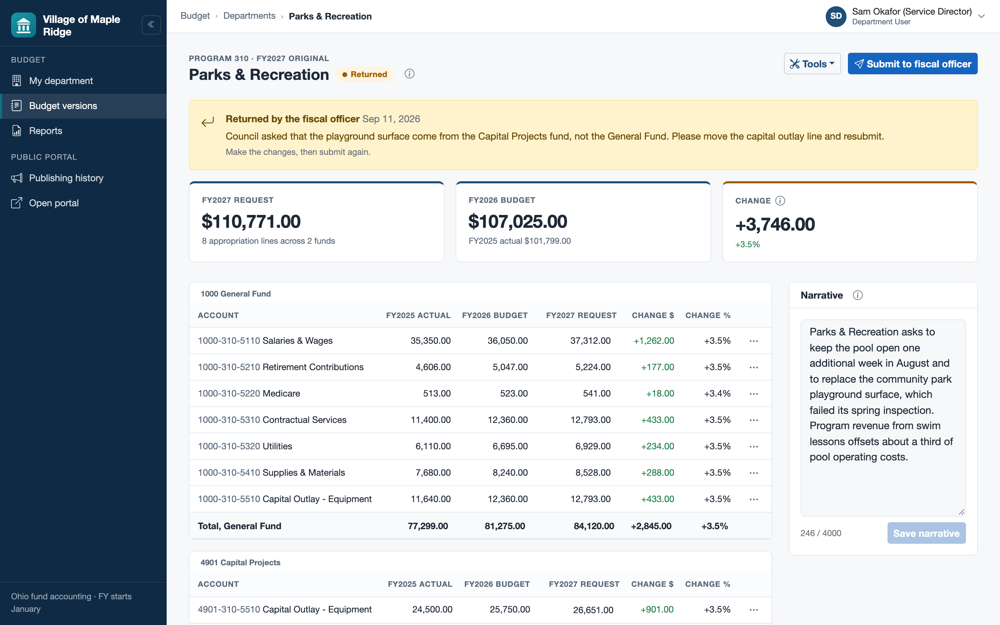
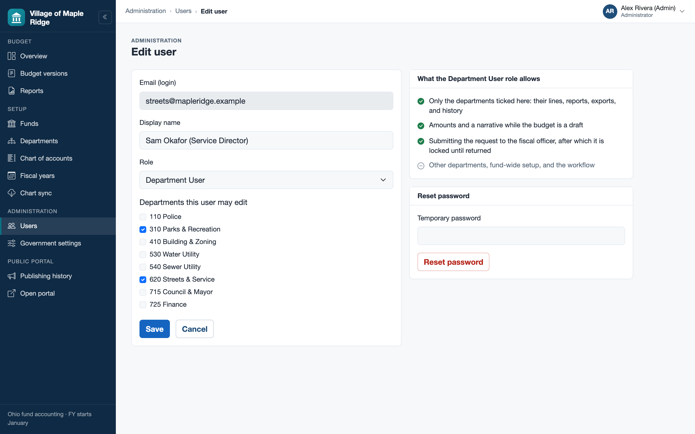
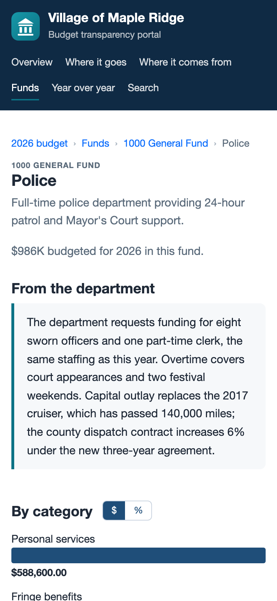
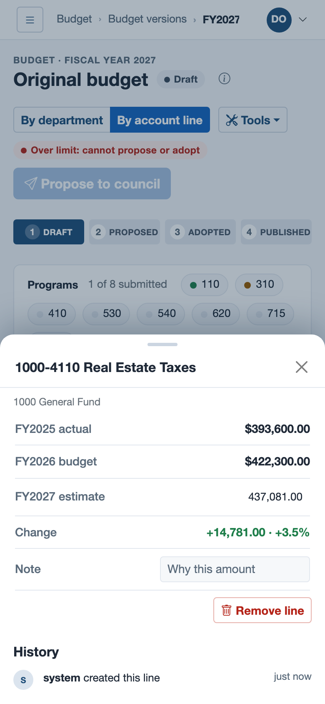
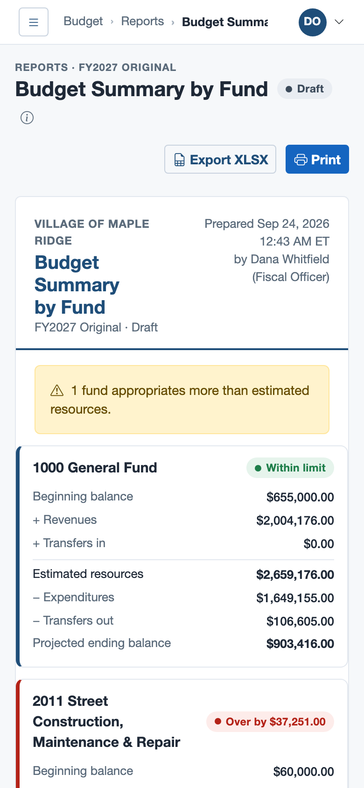
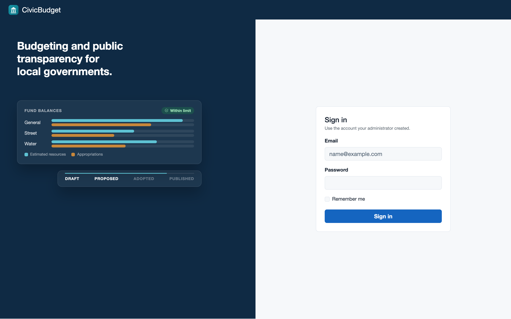
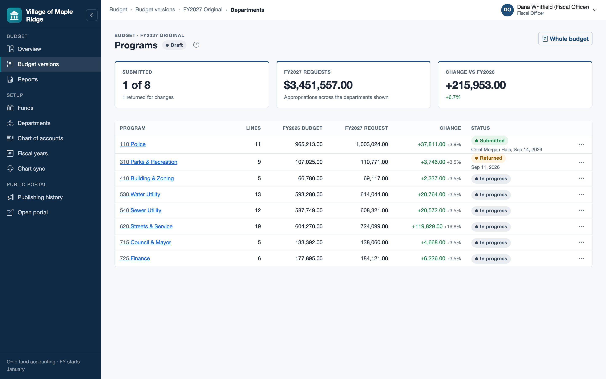
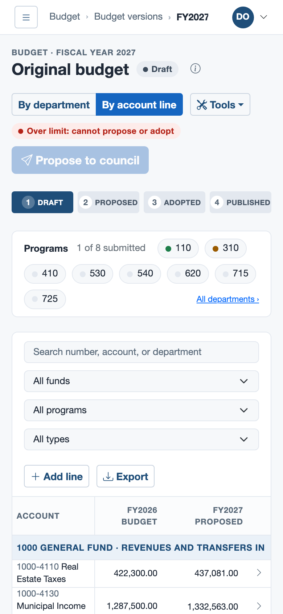

# CivicBudget

[](https://github.com/SpencerSmithSite/civic-budget/actions/workflows/ci.yml)

CivicBudget is a web application for building a local government's annual budget and
publishing it to the public. It is built around how Ohio villages, townships, cities, and
counties actually budget: money is kept in funds, each fund's spending is capped by what it
can expect to have, departments hand their requests to a fiscal officer, council adopts the
budget by resolution, and changes during the year are made by amendment.

I built it as a portfolio project for .NET and Blazor work on government ERP software, and I
built it the way I would build the real thing: the domain rules come from Ohio law and the
Auditor of State's chart of accounts, the app is meant to sit beside a government's existing
ERP rather than replace it, and every non-obvious decision is written down. All of the data is
fictional (the Village of Maple Ridge and Pine Hollow Township do not exist).

It has two halves:

- **The admin app**, for finance staff and department heads. The chart of accounts is kept
  here or synced from the ERP; each department enters its own request with a written
  narrative and submits it; the fiscal officer sees live fund balances against the Ohio
  appropriation limit, moves the budget from draft to proposed to adopted, amends it
  mid-year, imports and exports spreadsheets, prints reports, and publishes. Every change is
  in an audit trail.
- **The public transparency portal**, for citizens. No sign-in, fast, readable on a phone,
  and no JavaScript at all. It shows only what was published: where the money comes from,
  where it goes, each fund and department, year over year, search, and downloads.

## What it looks like

| Budget entry: the fiscal officer's worksheet | A department's own request |
|---|---|
|  |  |
| **The public portal** | **Who can see what** |
|  |  |

On a phone, the portal and the admin app both work at 390 px without sideways scrolling:

| Portal overview | A department, in its own words | A budget line's detail sheet | Fund summary as cards |
|---|---|---|---|
|  |  |  |  |

<details>
<summary>More screens</summary>

| Sign in | Admin overview |
|---|---|
|  |  |
| **Where every department stands** | **Budget Summary by Fund** |
|  |  |
| **Import preview** | **A fund on the portal** |
|  |  |

| The worksheet on a phone |
|---|
|  |

</details>

The screenshots are regenerated by `scripts/screenshots/capture.mjs` from fresh seed data.

## Try the live demo

**https://civicbudget-app.ashysmoke-cd0f52a4.centralus.azurecontainerapps.io**

It runs on Azure's free tiers, so it sleeps when nobody is using it. The first visit after a
quiet spell takes about 15 to 20 seconds to appear while Azure starts a container. If the
database has been idle for an hour as well, a "Waking up the demo" screen explains the wait and
moves on by itself within about a minute. After that, pages load normally. The database is
rebuilt from the seed every night at 08:00 UTC, so feel free to change anything.

All the demo logins share one password, published here on purpose: **`Demo-Bpe1GyRie5-1!`**

| Login | Role | What to try |
|---|---|---|
| `finance@mapleridge.example` | Fiscal Officer | The whole budget: the FY2027 draft (the Street fund is over its limit on purpose), the department board, workflow, amendments, publishing, import, reports |
| `police@mapleridge.example` | Department User | Lands on the Police department's request, which is already submitted and so locked |
| `streets@mapleridge.example` | Department User | Streets & Service, still being entered; Parks & Recreation, returned with a note from the fiscal officer |
| `admin@mapleridge.example` | Administrator | Everything the Fiscal Officer can do, plus users, government settings, and the logo |
| `viewer@mapleridge.example` | Viewer | Read-only |
| `admin@pinehollow.example` | Administrator of a second government | Pine Hollow Township only: proof that one government never sees another's data |

The public portal needs no login: [Village of Maple Ridge](https://civicbudget-app.ashysmoke-cd0f52a4.centralus.azurecontainerapps.io/transparency/maple-ridge-oh).
[docs/DEMO-SCRIPT.md](docs/DEMO-SCRIPT.md) is a ten-minute tour.

## How it is built

| | |
|---|---|
| Platform | .NET 10, C#, ASP.NET Core, Blazor Web App |
| Admin app | Blazor Interactive Server, QuickGrid, Bootstrap 5 themed with CSS variables |
| Portal | Blazor static server rendering, output caching, no JavaScript |
| Data | EF Core on SQL Server 2022, ASP.NET Core Identity, FluentValidation, ClosedXML for Excel |
| Tests | xUnit, bUnit, Testcontainers (a real SQL Server in Docker), CDK assertions; 638 tests |
| Delivery | Docker, GitHub Actions with OIDC sign-in; live on Azure (Bicep), deploy-ready on AWS (CDK in C#) |

The code is four projects with dependencies pointing inward: `Domain` (entities and budget
rules, no framework), `Application` (use cases and the interfaces they need), `Infrastructure`
(EF Core, Identity, Excel), and `Web` (Blazor and the composition root). A test fails the build
if a dependency points the wrong way.

## Problems worth reading about

These are the parts I would walk an interviewer through, because each one had an easy answer
that would have been wrong.

- **Keeping draft numbers off the public site.** The portal does not filter the live budget by
  status. Publishing copies the adopted budget into separate snapshot tables, and the portal's
  database context cannot even see the live tables. ([ADR-0005](docs/DECISIONS.md#adr-0005-the-public-portal-reads-immutable-published-snapshots-only), [ADR-0006](docs/DECISIONS.md#adr-0006-a-separate-read-only-publicportaldbcontext))
- **Many governments in one database.** Every query is filtered to the signed-in user's
  government by EF Core query filters, and a save interceptor refuses writes to anyone else's
  rows, so isolation does not depend on every developer remembering a `Where`. ([ADR-0004](docs/DECISIONS.md#adr-0004-tenancy-through-itenantcontext-and-ef-core-global-query-filters), [ADR-0013](docs/DECISIONS.md#adr-0013-the-tenant-interceptor-verifies-rather-than-stamps))
- **A DbContext in Blazor Server.** A Blazor circuit lives as long as the browser tab, so a
  "scoped" DbContext would live for hours and be shared by overlapping events. Every unit of
  work gets its own context from a factory. ([ADR-0003](docs/DECISIONS.md#adr-0003-idbcontextfactory-instead-of-a-scoped-dbcontext-in-blazor-server))
- **Two people editing one budget.** Each budget version carries a revision number that every
  change bumps and every save checks, so the second of two simultaneous saves is refused
  instead of silently overwriting the first. ([Walkthrough 20](docs/walkthroughs/20-budget-rules.md))
- **What a department's total is.** I researched how Ohio appropriates (ORC 5705.38, the UAN
  chart) before deciding: a department's total is its expenditures; revenue it collects and
  transfers out are shown beside it, not added in. ([ADR-0033](docs/DECISIONS.md#adr-0033-department-totals-starting-a-years-budget-and-optimistic-concurrency))
- **A site that sleeps.** On the free tier the database pauses after an hour. The app now starts
  listening before the database is ready and shows a waiting screen, instead of a browser that
  hangs for a minute; finding the hidden startup call that caused the hang is its own story.
  ([ADR-0031](docs/DECISIONS.md#adr-0031-the-host-listens-before-the-database-is-ready-and-shows-a-waiting-screen), [Walkthrough 18](docs/walkthroughs/18-cold-start.md))
- **Plugging into an ERP.** The chart of accounts arrives through a small adapter contract, is
  previewed before it is applied, and codes are retired rather than deleted because old budgets
  still point at them. ([ADR-0025](docs/DECISIONS.md#adr-0025-the-chart-of-accounts-is-received-from-the-erp-through-an-adapter-never-deleted-and-owned-by-a-switch))

## Run it locally

You need the .NET 10 SDK and Docker Desktop. On Apple Silicon, turn on *Use Rosetta for
x86_64/amd64 emulation* in Docker Desktop, because SQL Server's image is amd64 only.

```bash
./scripts/dev-setup.sh                      # once: a SQL password in .env, the connection string and demo password in user-secrets
docker compose up -d                        # SQL Server 2022
dotnet run --project src/CivicBudget.Web    # migrates and seeds, then serves https://localhost:5001 and http://localhost:5000
```

Sign in with the logins above. `dev-setup.sh` prints the local demo password once; it is kept in
user-secrets (`dotnet user-secrets list --project src/CivicBudget.Web`). The portal is at
`/transparency/maple-ridge-oh`, and Pine Hollow's at `/transparency/pine-hollow-twp-oh`.

To start again from clean seed data: `docker compose down -v && docker compose up -d`.

To run the app itself in a container too: `docker compose -f docker-compose.full.yml up --build`,
then open http://localhost:8080.

```bash
dotnet test                                 # everything; integration tests start their own SQL Server container, infra tests need Node.js
dotnet test tests/CivicBudget.Domain.Tests  # the budget rules alone, in well under a second
```

## Deployment

**Azure (the live demo).** `infra/azure/main.bicep` describes a serverless Azure SQL database on
the free offer, a Container App that scales to zero, and a nightly job that runs the same image
with `--reseed`. `scripts/azure-setup.sh` creates it once; after that every push to `main` that
passes CI is deployed by `.github/workflows/deploy-azure.yml`, which signs in to Azure with OIDC,
so no credential is stored in GitHub. See [infra/azure/README.md](infra/azure/README.md) and
[ADR-0030](docs/DECISIONS.md#adr-0030-the-live-demo-runs-on-azures-free-tiers-the-database-is-rebuilt-from-the-seed-every-night).

**AWS (deploy-ready).** `infra/CivicBudget.Infra` is an AWS CDK app in C#: a VPC, SQL Server on
RDS in private subnets, the app on Fargate behind a load balancer, Secrets Manager, CloudWatch,
a spending alarm, and an OIDC deploy role. CI synthesizes it and runs assertion tests on the
templates on every change. I have no AWS account behind this repository, so it has never been
deployed; it shows the production-shaped design. See [infra/README.md](infra/README.md) and
[walkthrough 08](docs/walkthroughs/08-aws-deploy-ready.md).

## How to read this repository

1. [docs/SPEC.md](docs/SPEC.md): what an Ohio budget is and what the app does with it.
2. [docs/ARCHITECTURE.md](docs/ARCHITECTURE.md): the layers, render modes, tenancy, and the
   snapshot boundary, with diagrams.
3. The walkthroughs, one per phase, in the order I built them. Each explains what was built,
   why, and what to read in the code:
   [01 Foundation](docs/walkthroughs/01-foundation.md) ·
   [02 Identity and authorization](docs/walkthroughs/02-identity-and-authorization.md) ·
   [03 Budget entry and audit](docs/walkthroughs/03-budget-entry-and-audit.md) ·
   [04 Workflow and publishing](docs/walkthroughs/04-workflow-and-publishing.md) ·
   [05 Design system](docs/walkthroughs/05-design-system.md) ·
   [06 Public portal](docs/walkthroughs/06-public-portal.md) ·
   [07 Import, export, reports](docs/walkthroughs/07-import-export-reports.md) ·
   [08 AWS](docs/walkthroughs/08-aws-deploy-ready.md) ·
   [09 Polish](docs/walkthroughs/09-polish.md) ·
   [10 Account numbers](docs/walkthroughs/10-account-numbers.md) ·
   [11 ERP chart sync](docs/walkthroughs/11-erp-chart-sync.md) ·
   [12 Users and permissions](docs/walkthroughs/12-users-and-permissions.md) ·
   [13 Department-first budgeting](docs/walkthroughs/13-department-first-budgeting.md) ·
   [14 Branding and profile pictures](docs/walkthroughs/14-branding-and-profile-pictures.md) ·
   [15 Portal polish](docs/walkthroughs/15-portal-polish.md) ·
   [16 Azure](docs/walkthroughs/16-azure-demo.md) ·
   [17 Phone layouts](docs/walkthroughs/17-phone-layouts.md) ·
   [18 Cold start](docs/walkthroughs/18-cold-start.md) ·
   [19 Maintenance](docs/walkthroughs/19-maintenance.md) ·
   [20 Budget rules](docs/walkthroughs/20-budget-rules.md)
4. [docs/DECISIONS.md](docs/DECISIONS.md) when you want to know why: 33 decision records, each
   with the alternatives I turned down, and the table of every package and why it is there.
5. Then the code, starting at `src/CivicBudget.Domain/Budgets/BudgetVersion.cs`, the heart of it.

Also: [Demo script](docs/DEMO-SCRIPT.md) · [Interview prep](docs/INTERVIEW-PREP.md) ·
[Design brief](docs/design/DESIGN-BRIEF.md) · [Roadmap](ROADMAP.md) · [Changelog](CHANGELOG.md)

```
src/CivicBudget.Domain          entities and budget rules; references nothing but .NET
src/CivicBudget.Application     use cases, DTOs, validators, the interfaces Infrastructure implements
src/CivicBudget.Infrastructure  EF Core, migrations, interceptors, Identity, Excel, seed data
src/CivicBudget.Web             Blazor admin app and portal, endpoints, startup, the composition root
tests/                          one test project per layer, plus integration tests against SQL Server
infra/                          AWS CDK (C#) and the Azure Bicep template
docs/                           spec, architecture, decisions, walkthroughs, design
```

## Rights

Copyright © 2026 Spencer Smith. **All rights reserved.** This repository is public for portfolio
review only. It is not licensed for use, modification, or distribution.
