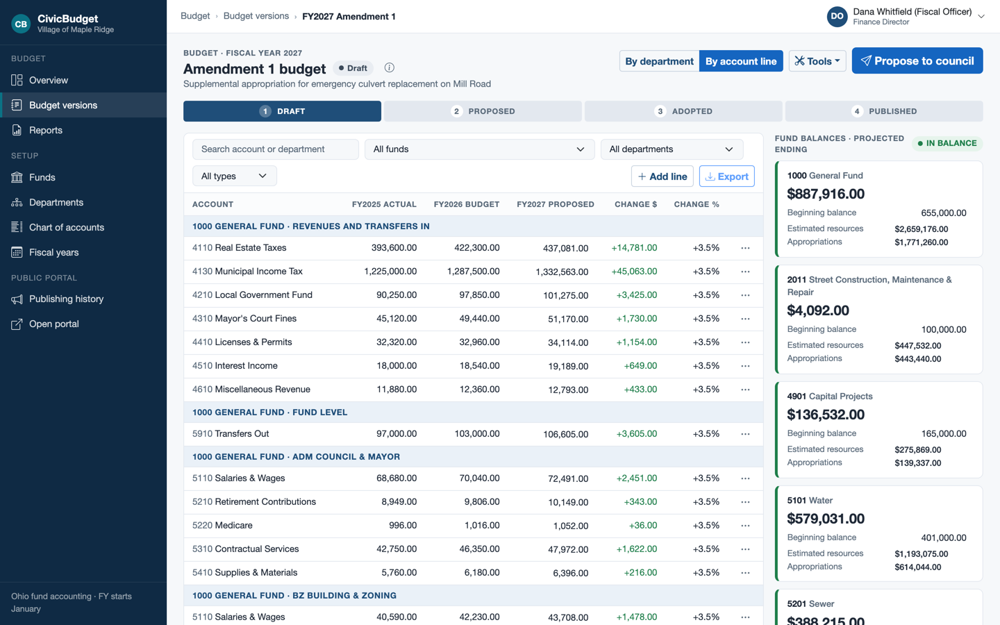
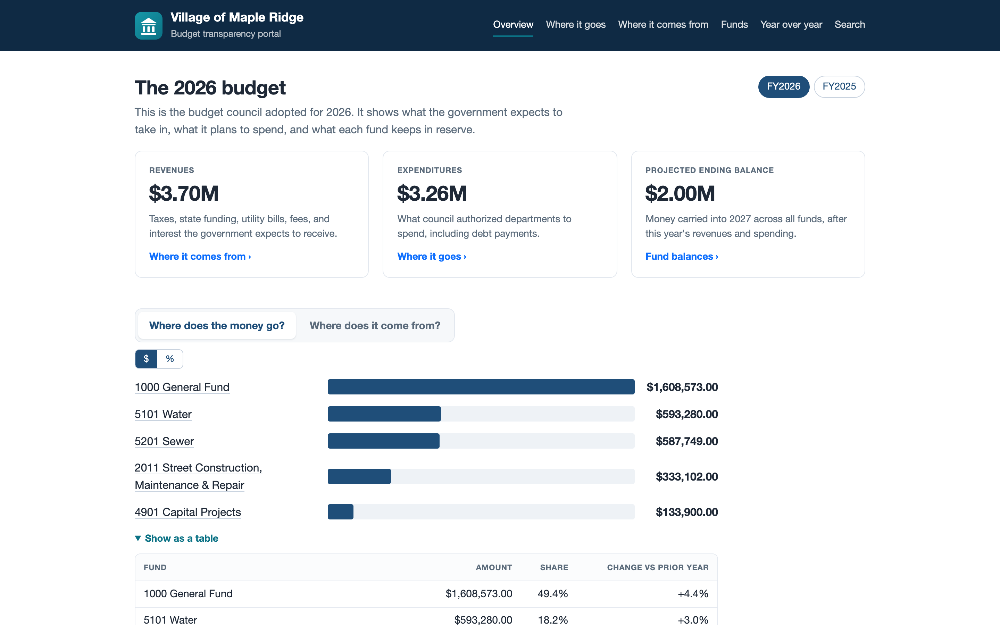
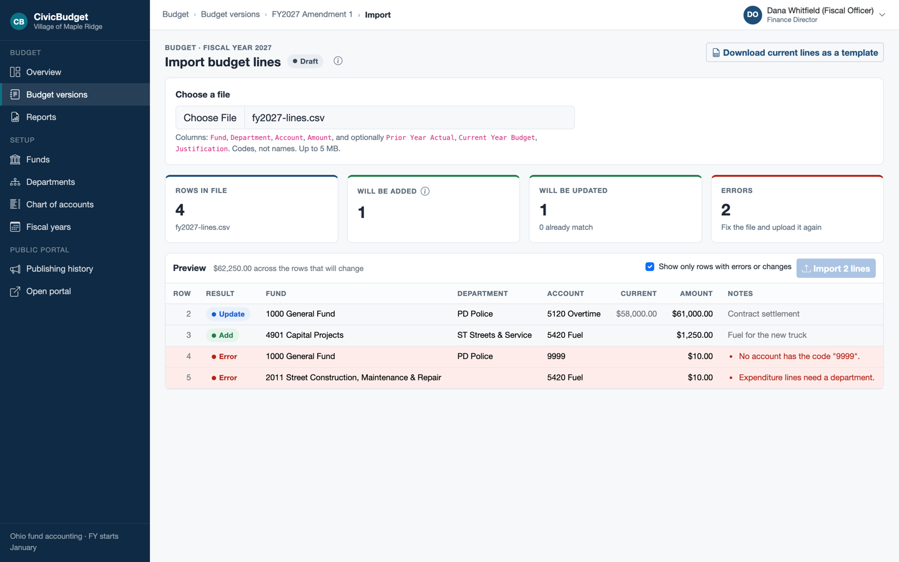
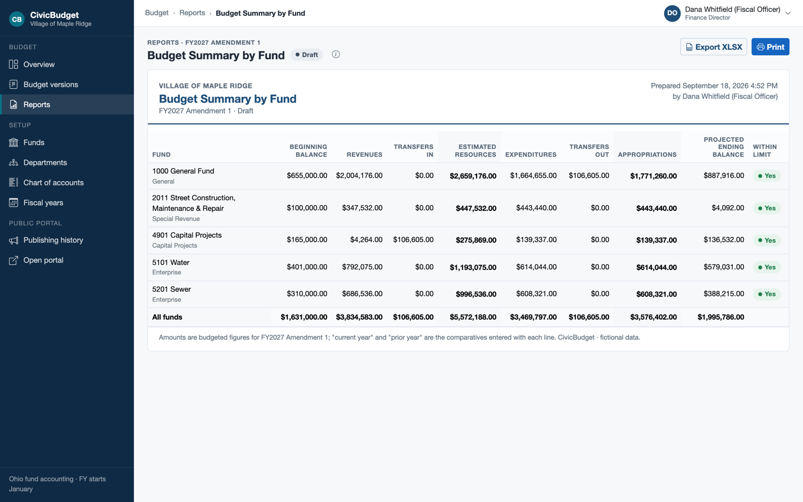
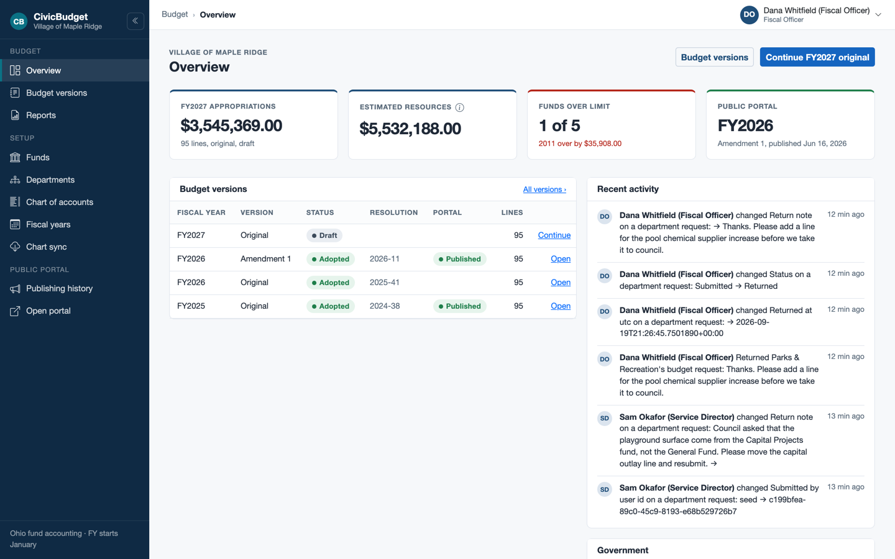
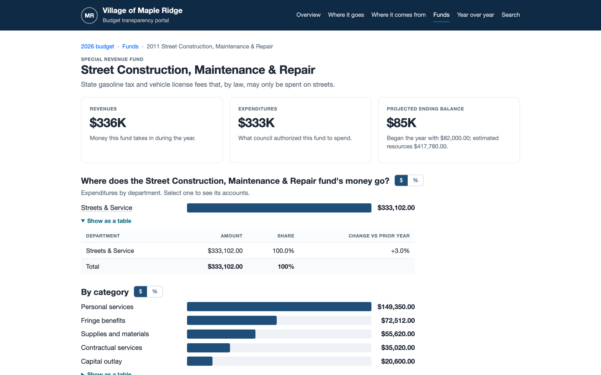
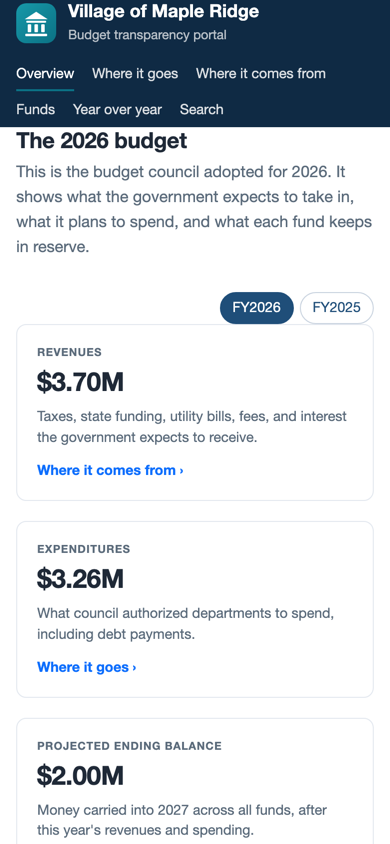

# CivicBudget

A multi-tenant budgeting and public-transparency web application for local
governments (cities, villages, townships, counties), built with .NET 10,
Blazor, EF Core, and SQL Server, with a deploy-ready AWS CDK stack.

[](https://github.com/SpencerSmithSite/civic-budget/actions/workflows/ci.yml)

> **Status:** Complete (Phase 8). Eight phases, each a reviewed PR with a walkthrough; see [ROADMAP.md](ROADMAP.md) and the [demo script](docs/DEMO-SCRIPT.md).

**Two audiences, one solution**
- **Admin app** — finance staff and department heads build the annual budget:
  fund/department/account setup, two budget-entry modes, live fund-balance
  checks with Ohio-style appropriation limits, Draft → Proposed → Adopted
  workflow, amendments, audit trail, import/export, reports.
- **Public transparency portal** — citizens browse the *published* budget:
  fast, accessible (WCAG 2.1 AA target), no login, works on a phone and
  without JavaScript.

All data is fictional (Village of Maple Ridge, Ohio).

## What it looks like

| Budget workspace (Interactive Server) | Public portal (static SSR) |
|---|---|
|  |  |
|  |  |

<details>
<summary>More screens</summary>

| Admin overview | Portal fund page | Portal on a phone |
|---|---|---|
|  |  |  |

</details>

## Run locally

Prerequisites: .NET SDK 10, Docker Desktop (on Apple Silicon, enable *Use Rosetta for x86_64/amd64 emulation*).

```bash
./scripts/dev-setup.sh                      # once: generates a SQL password into .env and user-secrets
docker compose up -d                        # SQL Server 2022, healthy in ~15–30 s
dotnet run --project src/CivicBudget.Web    # migrates + seeds, then serves on https://localhost:5001 (and http://localhost:5000)
```

Then open `https://localhost:5001` and log in (accept the ASP.NET Core dev certificate, or use http://localhost:5000). `scripts/dev-setup.sh` prints the demo password once and
keeps it in user-secrets (`dotnet user-secrets list --project src/CivicBudget.Web`).

| Login | Role | Sees |
|---|---|---|
| `admin@mapleridge.example` | Administrator | Users, government settings, setup |
| `finance@mapleridge.example` | Finance Director | Setup; budget entry in both modes; beginning balances |
| `police@mapleridge.example` | Department Head (Police) | Own department's lines, grouped view |
| `streets@mapleridge.example` | Department Head (Streets, Parks) | Own departments' lines, grouped view |
| `viewer@mapleridge.example` | Viewer | Read-only overview |
| `admin@pinehollow.example` | Administrator (second tenant) | Pine Hollow only; proves isolation |

The public portal needs no login: open `http://localhost:5000/transparency/maple-ridge-oh`
(Pine Hollow Township is at `/transparency/pine-hollow-twp-oh`). Publish an amendment in the
admin app and the portal shows it on the next request.

To start over with fresh seed data: `docker compose down -v && docker compose up -d`.

### Everything in containers

```bash
docker compose -f docker-compose.full.yml up --build     # app image + SQL Server; open http://localhost:8080
```

### AWS (deploy-ready, not deployed)

`infra/CivicBudget.Infra` is an AWS CDK app in C#: VPC, RDS SQL Server Express, Fargate behind an
ALB, Secrets Manager, CloudWatch, a spending alarm, and a GitHub OIDC deploy role. CI synthesizes
it and runs 17 assertion tests on the templates; `.github/workflows/deploy.yml` deploys on a `v*`
tag once an account's role ARN is set. There is no account behind this repository (ADR-0008), so
nothing is live; see [infra/README.md](infra/README.md) and [walkthrough 08](docs/walkthroughs/08-aws-deploy-ready.md).

```bash
dotnet test                                 # all 404 tests; integration tests start their own SQL Server container, infra tests need Node.js
```

## How to read this repository

1. [docs/SPEC.md](docs/SPEC.md) for what an Ohio budget is and what the app does (§12 maps the spec to what shipped).
2. [docs/ARCHITECTURE.md](docs/ARCHITECTURE.md) for the layers, render modes, tenancy, and the snapshot boundary.
3. The walkthroughs in order, one per phase: [01 foundation](docs/walkthroughs/01-foundation.md) → [02 identity](docs/walkthroughs/02-identity-and-authorization.md) → [03 entry and audit](docs/walkthroughs/03-budget-entry-and-audit.md) → [04 workflow and publishing](docs/walkthroughs/04-workflow-and-publishing.md) → [05 design system](docs/walkthroughs/05-design-system.md) → [06 portal](docs/walkthroughs/06-public-portal.md) → [07 import and reports](docs/walkthroughs/07-import-export-reports.md) → [08 AWS](docs/walkthroughs/08-aws-deploy-ready.md) → [09 polish](docs/walkthroughs/09-polish.md).
4. [docs/DECISIONS.md](docs/DECISIONS.md) when you want to know why (23 ADRs and the package table).
5. Then the code, starting at `src/CivicBudget.Domain/Budgets/BudgetVersion.cs`.

Also: [Design brief](docs/design/DESIGN-BRIEF.md) · [Demo script](docs/DEMO-SCRIPT.md) · [Interview prep](docs/INTERVIEW-PREP.md) · [Roadmap](ROADMAP.md)

## Rights
Copyright © 2026 Spencer Smith. **All rights reserved.** This repository is
published for portfolio review only. It is not licensed for use,
modification, or distribution.

## Branch protection (recommended settings for `main`)
- Require a pull request before merging; require the `ci` status check.
- Block force pushes and deletions.
- (Optional) Require linear history.
