# CivicBudget

[](https://github.com/SpencerSmithSite/civic-budget/actions/workflows/ci.yml)

CivicBudget is a web application for building a local government's annual budget and
publishing it to the public. It is built around how Ohio villages, townships, cities, and
counties actually budget: money is kept in funds, each fund's spending is capped by what it
can expect to have, departments hand their requests to a fiscal officer, council adopts the
budget by resolution, and changes during the year are made by amendment.

I built it as a portfolio project for .NET and Blazor work on government ERP software, and I
built it the way I would build the real thing: the domain rules come from Ohio law and the
Auditor of State's chart of accounts, the app is meant to sit beside a government's existing
ERP rather than replace it, and every non-obvious decision is written down. All of the data is
fictional (the Village of Maple Ridge and Pine Hollow Township do not exist).

The product site is **[spencersmith.site/CivicBudget](https://spencersmith.site/CivicBudget/)**:
what it does, three short clips of it working, the security summary, and the demo logins.

It has two halves:

- **The admin app**, for finance staff and department heads. The chart of accounts is kept
  here or synced from the ERP; each department enters its own request with a written
  narrative and submits it, seeing this year's spending from the ERP beside each line; the fiscal officer sees live fund balances against the Ohio
  appropriation limit, moves the budget from draft to proposed to adopted, sends the adopted
  budget to the ERP with one button, amends it mid-year, imports and exports spreadsheets, prints reports, and publishes. Every change is
  in an audit trail.
- **The public transparency portal**, for citizens. No sign-in, fast, readable on a phone,
  and no JavaScript at all. It shows only what was published: where the money comes from,
  where it goes, each fund and department, year over year, search, and downloads.

## What it looks like

| Budget entry: the fiscal officer's worksheet | A department's own request |
|---|---|
| 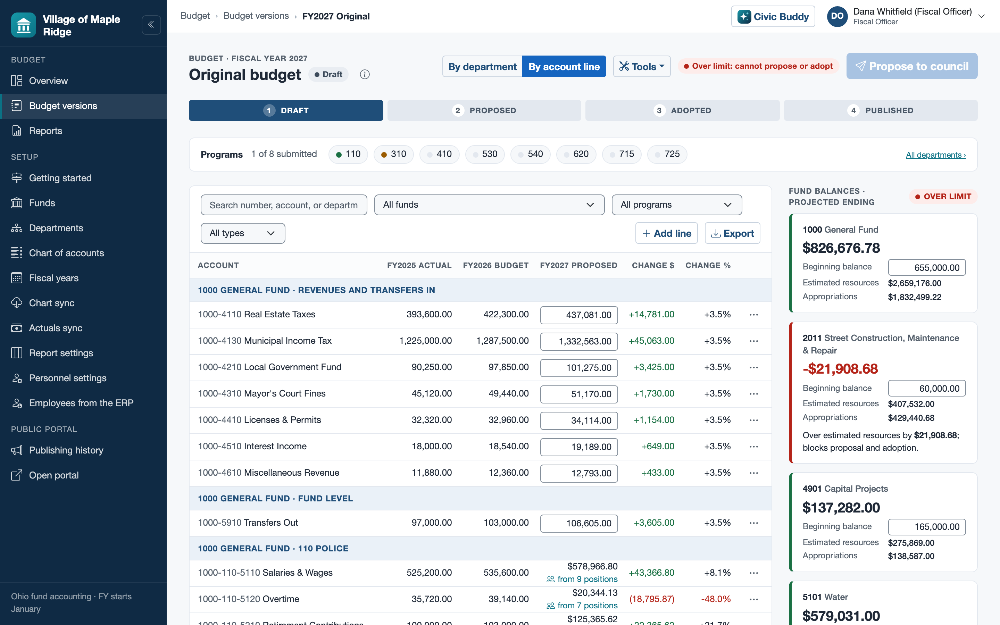 | 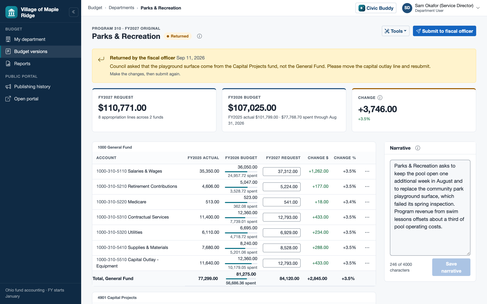 |
| **The public portal** | **Who can see what** |
| 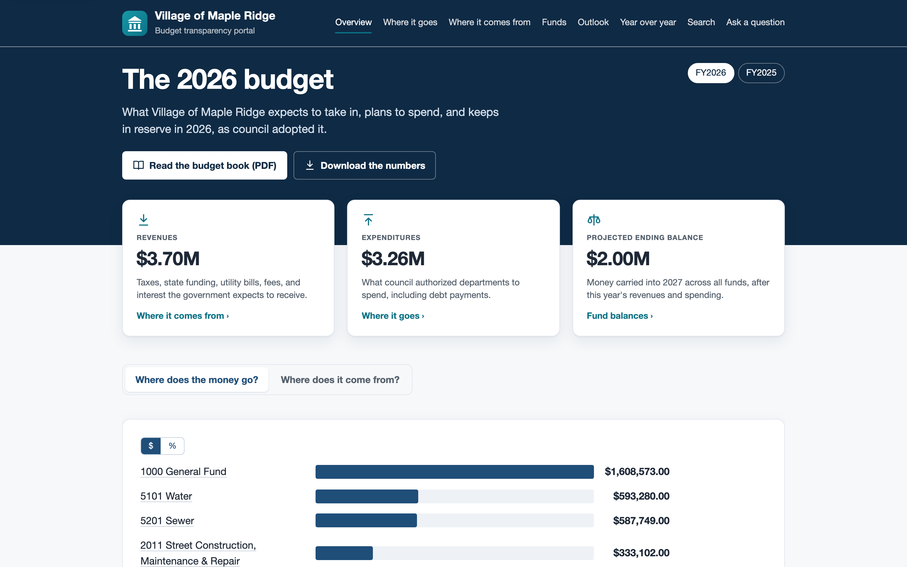 | 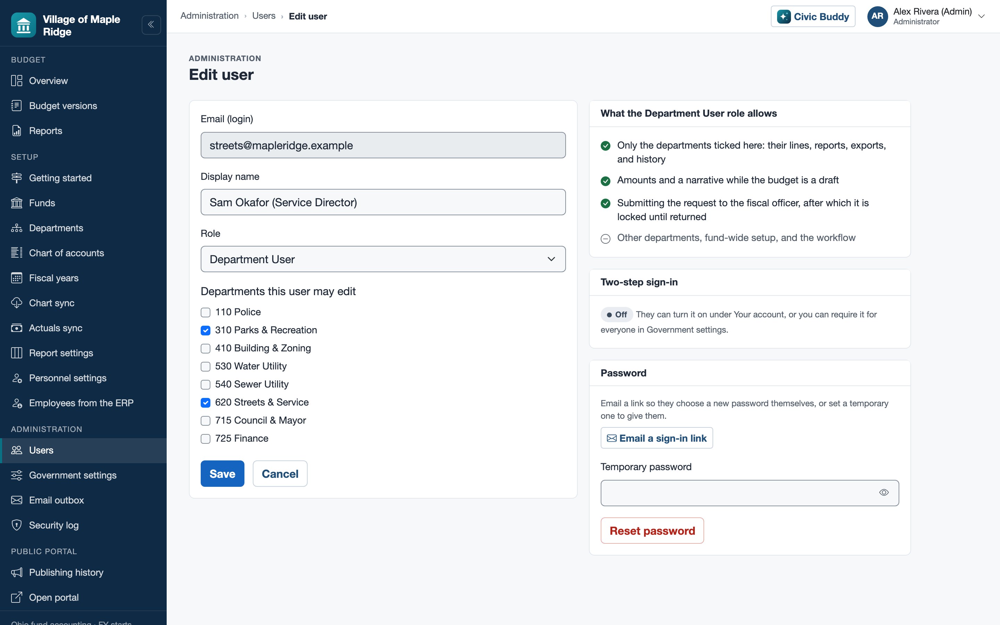 |

On a phone, the portal and the admin app both work at 390 px without sideways scrolling:

| Portal overview | A department, in its own words | A budget line's detail sheet | Fund summary as cards |
|---|---|---|---|
| 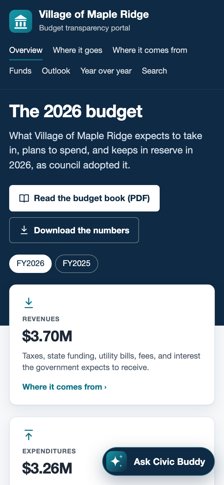 | 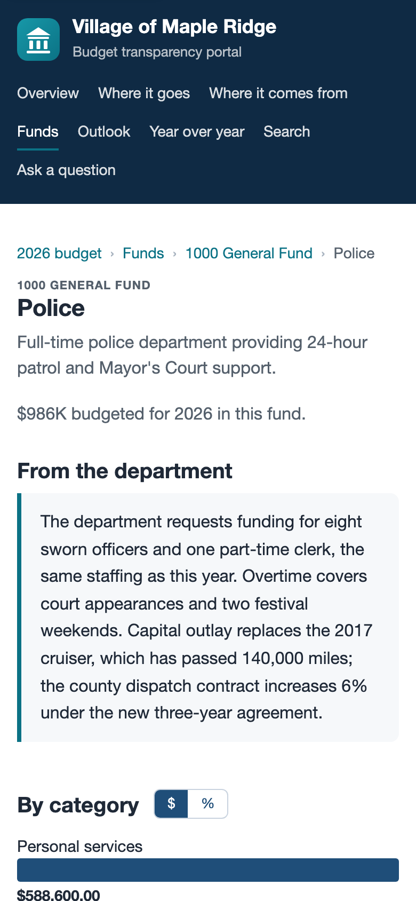 | 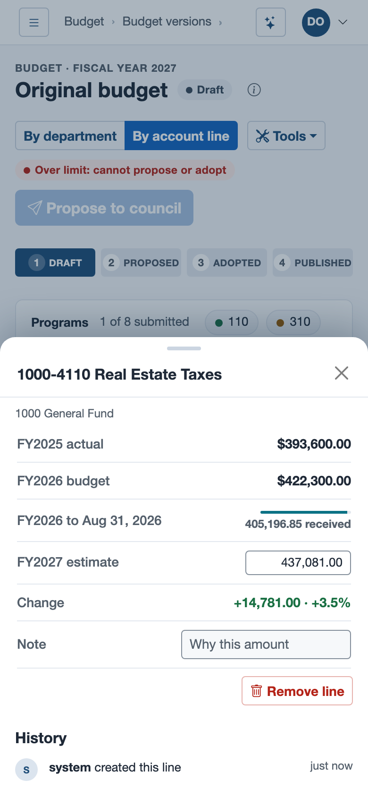 | 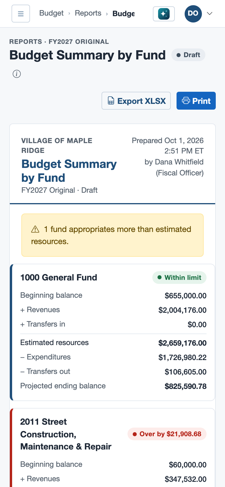 |

<details>
<summary>More screens</summary>

| Sign in | Admin overview |
|---|---|
| 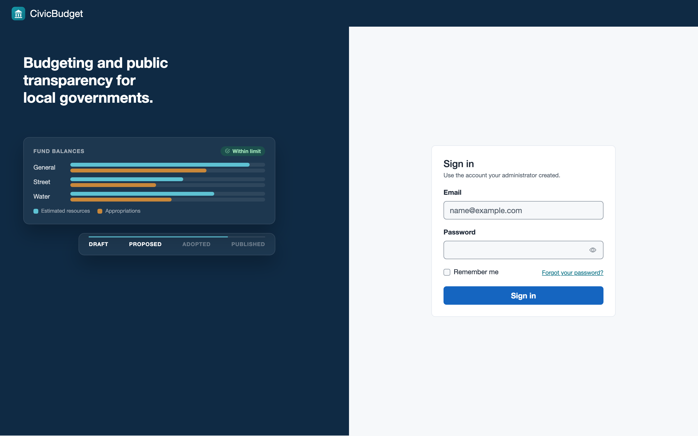 | 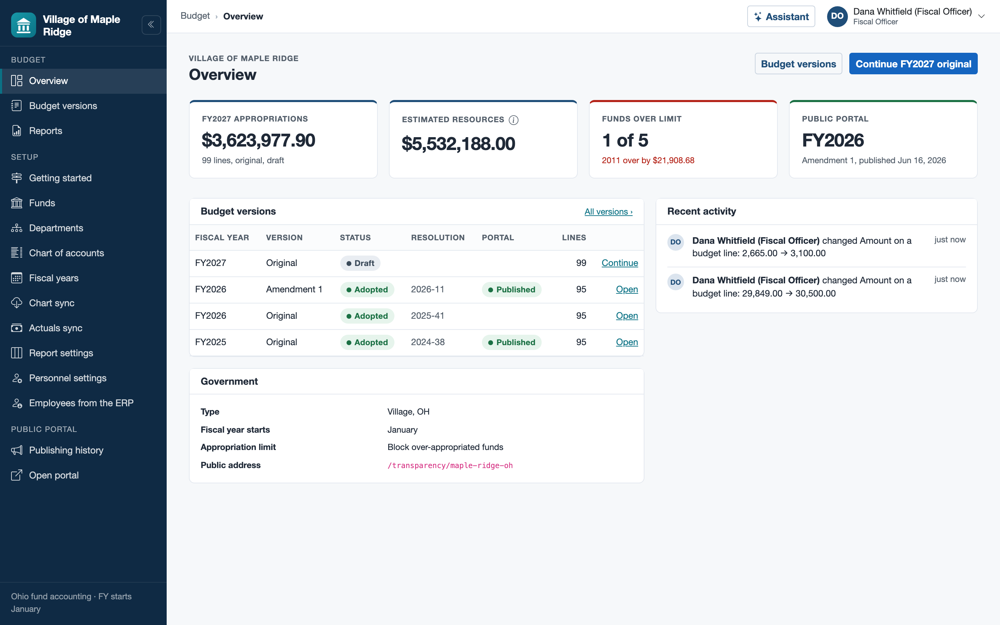 |
| **Where every department stands** | **Budget Summary by Fund** |
| 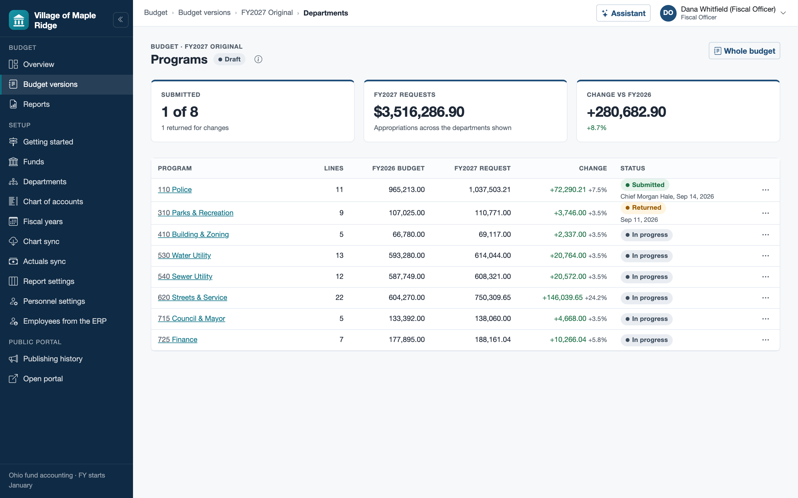 | 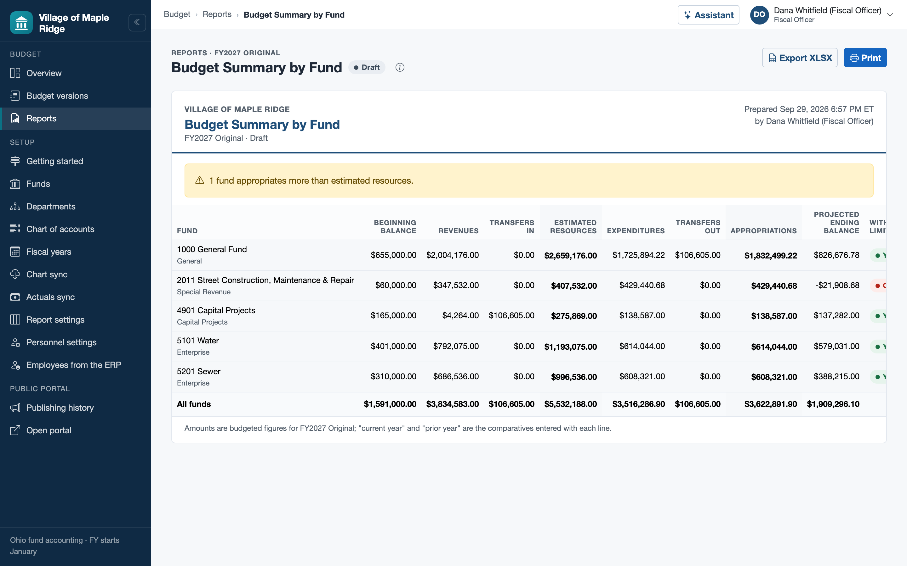 |
| **Import preview** | **A fund on the portal** |
| 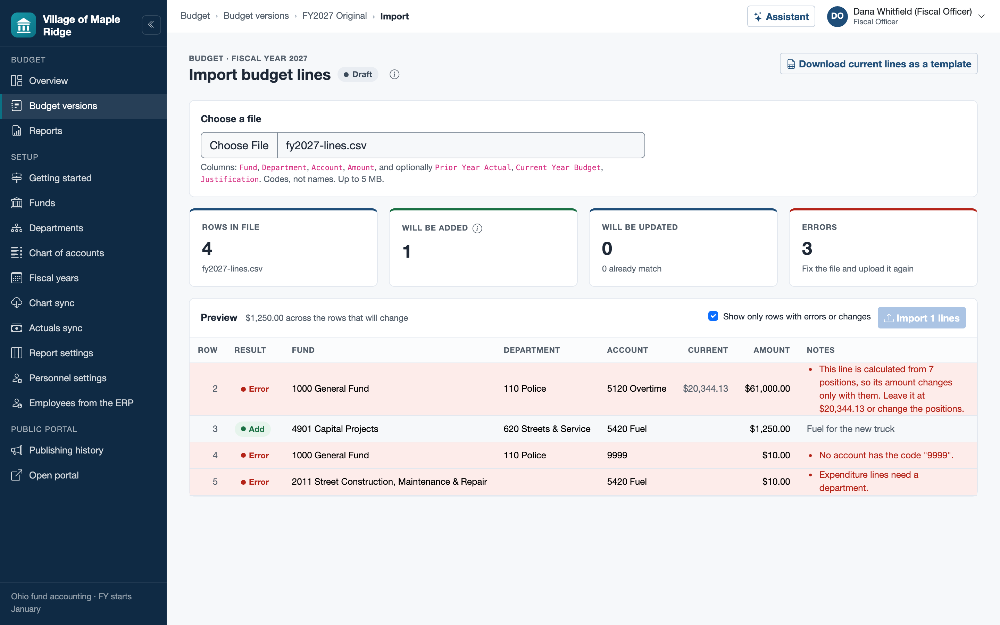 | 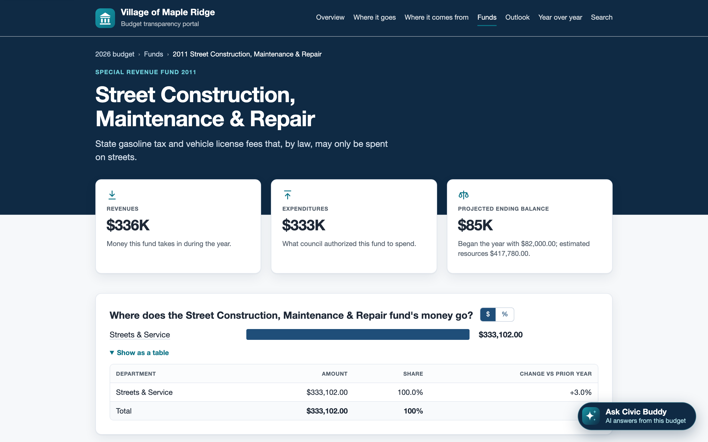 |

| The worksheet on a phone |
|---|
| 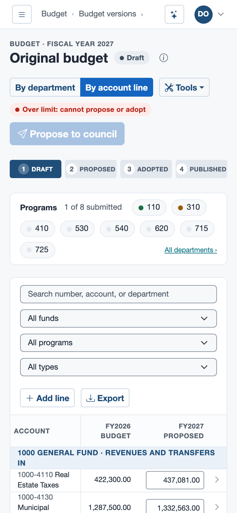 |

</details>

The screenshots are regenerated by `scripts/screenshots/capture.mjs` from fresh seed data.

## Try the live demo

**https://civicbudget-app.ashysmoke-cd0f52a4.centralus.azurecontainerapps.io**

It runs on Azure's free tiers, so it sleeps when nobody is using it. The first visit after a
quiet spell takes about 15 to 20 seconds to appear while Azure starts a container. If the
database has been idle for an hour as well, a "Waking up the demo" screen explains the wait and
moves on by itself within about a minute. After that, pages load normally. The database is
rebuilt from the seed every night at 08:00 UTC, so feel free to change anything.

All the demo logins share one password, published here on purpose: **`Demo-Bpe1GyRie5-1!`**

| Login | Role | What to try |
|---|---|---|
| `finance@mapleridge.example` | Fiscal Officer | The whole budget: the FY2027 draft (the Street fund is over its limit on purpose), the department board, workflow, amendments, publishing, import, reports, Setup, Actuals sync to fetch a year from the simulated ERP, and the FY2026 amendment's Send to ERP |
| `police@mapleridge.example` | Department User | Lands on the Police department's request, which is already submitted and so locked |
| `streets@mapleridge.example` | Department User | Streets & Service, still being entered; Parks & Recreation, returned with a note from the fiscal officer |
| `admin@mapleridge.example` | Administrator | Everything the Fiscal Officer can do, plus users, government settings, and the logo |
| `viewer@mapleridge.example` | Viewer | Read-only |
| `admin@pinehollow.example` | Administrator of a second government | Pine Hollow Township only: proof that one government never sees another's data |

The public portal needs no login: [Village of Maple Ridge](https://civicbudget-app.ashysmoke-cd0f52a4.centralus.azurecontainerapps.io/transparency/maple-ridge-oh).
[docs/DEMO-SCRIPT.md](docs/DEMO-SCRIPT.md) is a ten-minute tour.

## How it is built

| | |
|---|---|
| Platform | .NET 10, C#, ASP.NET Core, Blazor Web App |
| Admin app | Blazor Interactive Server, QuickGrid, Bootstrap 5 themed with CSS variables |
| Portal | Blazor static server rendering, output caching, no JavaScript |
| Data | EF Core on SQL Server 2022, ASP.NET Core Identity, FluentValidation, ClosedXML for Excel |
| Tests | xUnit, bUnit, Testcontainers (a real SQL Server in Docker), CDK assertions; 912 tests |
| Delivery | Docker, GitHub Actions with OIDC sign-in; live on Azure (Bicep), deploy-ready on AWS (CDK in C#) |

The code is four projects with dependencies pointing inward: `Domain` (entities and budget
rules, no framework), `Application` (use cases and the interfaces they need), `Infrastructure`
(EF Core, Identity, Excel), and `Web` (Blazor and the composition root). A test fails the build
if a dependency points the wrong way.

## Security

CivicBudget is **designed and built to achieve SOC 2 compliance** (Security, Availability, and
Confidentiality). The controls an auditor examines are built in, each mapped to its evidence and
to NIST CSF 2.0 and NIST 800-53 (the catalog GovRAMP uses). Among them:

- **Separation.** Every government's data is kept apart by a query filter on every table, proven
  by tests.
- **Roles** are checked by the services themselves, not just by hiding buttons.
- **Sign-in:**
  - two-step sign-in, which a government can require for everyone;
  - lockout, and rate limits on sign-in and password reset;
  - sign-out after 30 idle minutes.
- **Records:**
  - an audit trail of every budget change;
  - a security log of every sign-in, failure, and export.
- **The browser** gets a strict Content Security Policy.
- **A government's data** can be downloaded whole, and removed completely when the government
  leaves.
- **CI** runs code scanning (CodeQL) and fails on any package with a known vulnerability.

No auditor has issued a report yet. See [docs/security](docs/security/README.md) for the control
matrix, the operator's policies, and the known gaps, and [SECURITY.md](SECURITY.md) to report a
vulnerability.

## Accessibility

CivicBudget targets WCAG 2.2 AA. Every page for every role, and the public portal at phone width,
is scanned with axe-core, and the keyboard behavior was reviewed and fixed:
- focus moves into dialogs and the phone menu and comes back;
- errors are gathered, announced, and focused;
- nothing important depends on color or disappears on a timer.

The [accessibility conformance report](docs/accessibility/ACR.md) (VPAT 2.5 format) rates every
criterion. It is a self-evaluation, with no screen reader testing yet, and it says so.

## Problems worth reading about

These are the parts I would walk an interviewer through, because each one had an easy answer
that would have been wrong.

- **Keeping draft numbers off the public site.** The portal does not filter the live budget by
  status. Publishing copies the adopted budget into separate snapshot tables, and the portal's
  database context cannot even see the live tables. ([ADR-0005](docs/DECISIONS.md#adr-0005-the-public-portal-reads-immutable-published-snapshots-only), [ADR-0006](docs/DECISIONS.md#adr-0006-a-separate-read-only-publicportaldbcontext))
- **Many governments in one database.** Every query is filtered to the signed-in user's
  government by EF Core query filters, and a save interceptor refuses writes to anyone else's
  rows, so isolation does not depend on every developer remembering a `Where`. ([ADR-0004](docs/DECISIONS.md#adr-0004-tenancy-through-itenantcontext-and-ef-core-global-query-filters), [ADR-0013](docs/DECISIONS.md#adr-0013-the-tenant-interceptor-verifies-rather-than-stamps))
- **A DbContext in Blazor Server.** A Blazor circuit lives as long as the browser tab, so a
  "scoped" DbContext would live for hours and be shared by overlapping events. Every unit of
  work gets its own context from a factory. ([ADR-0003](docs/DECISIONS.md#adr-0003-idbcontextfactory-instead-of-a-scoped-dbcontext-in-blazor-server))
- **Two people editing one budget.** Each budget version carries a revision number that every
  change bumps and every save checks, so the second of two simultaneous saves is refused
  instead of silently overwriting the first. ([Walkthrough 20](docs/walkthroughs/20-budget-rules.md))
- **What a department's total is.** I researched how Ohio appropriates (ORC 5705.38, the UAN
  chart) before deciding: a department's total is its expenditures; revenue it collects and
  transfers out are shown beside it, not added in. ([ADR-0033](docs/DECISIONS.md#adr-0033-department-totals-starting-a-years-budget-and-optimistic-concurrency))
- **A site that sleeps.** On the free tier the database pauses after an hour. The app now starts
  listening before the database is ready and shows a waiting screen, instead of a browser that
  hangs for a minute; finding the hidden startup call that caused the hang is its own story.
  ([ADR-0031](docs/DECISIONS.md#adr-0031-the-host-listens-before-the-database-is-ready-and-shows-a-waiting-screen), [Walkthrough 18](docs/walkthroughs/18-cold-start.md))
- **Plugging into an ERP.** The chart of accounts arrives through a small adapter contract, is
  previewed before it is applied, and codes are retired rather than deleted because old budgets
  still point at them. ([ADR-0025](docs/DECISIONS.md#adr-0025-the-chart-of-accounts-is-received-from-the-erp-through-an-adapter-never-deleted-and-owned-by-a-switch))
- **The ERP's books beside the budget.** Actuals arrive a fiscal year at a time, from VIP's API
  (simulated in the demo) or an export file. One unknown account code refuses the whole year,
  because a missing account would quietly understate every total. A closed year fills the
  prior-year column; a year in progress never does. ([ADR-0034](docs/DECISIONS.md#adr-0034-actuals-come-from-the-erp-a-fiscal-year-at-a-time-a-closed-year-fills-prior-year-actuals), [Walkthrough 21](docs/walkthroughs/21-erp-actuals.md))
- **A send button that cannot post twice.** The adopted budget goes to VIP as a journal of only
  what changed since VIP last took the year. Each send is saved before VIP is called, a lost
  answer is retried under the same id, a downloaded file counts only once someone confirms it was
  imported, and the database allows one unfinished send per year. ([ADR-0035](docs/DECISIONS.md#adr-0035-the-adopted-budget-goes-to-the-erp-as-a-journal-of-changes-sent-once), [Walkthrough 22](docs/walkthroughs/22-send-to-erp.md))
- **An Ohio legal document, not just a report.** The certificate of estimated resources caps each
  fund's appropriations. Its balances come from the ERP's closed year, its "taxes" columns are the
  government's own choice of accounts, it reconciles itself against the budget, and it prints as a
  PDF ready for the budget commission to sign. ([ADR-0036](docs/DECISIONS.md#adr-0036-the-certificate-of-estimated-resources-report-columns-as-settings-and-migradoc-for-the-pdf), [Walkthrough 23](docs/walkthroughs/23-certificate.md))
- **"On track" that knows the seasons.** Budget against actual, revenue against receipts, and fund
  projections pace each account by where it stood last year at the same month, because by August
  a village has collected nearly all its property tax and two-thirds of nothing else. ([ADR-0037](docs/DECISIONS.md#adr-0037-reports-on-the-erps-books-are-paced-by-last-year-and-the-appropriation-measures-columns-are-settings), [Walkthrough 24](docs/walkthroughs/24-actuals-reports.md))
- **Salary lines nobody types.** Each position is priced from the year's settings (pay scale steps
  in their anniversary month, longevity from the contract, OPERS or OP&F, Medicare, workers'
  comp, insurance by tier), split across its funds, and summed into lines that say "from 9
  positions" and refuse a typed amount. Longevity reads back in plain English so it can be checked
  against the contract. ([ADR-0038](docs/DECISIONS.md#adr-0038-personnel-budgeting-positions-live-on-the-budget-version-settings-belong-to-a-year-and-lines-are-calculated), [Walkthrough 25](docs/walkthroughs/25-personnel.md))
- **The roster comes from the payroll.** Employees come in from the ERP by API or payroll export,
  with a preview of every hire, raise, and departure and every line it moves. The ERP's facts are
  refreshed and the budget's plans kept. The roster, cost by fund, and benefits summary add up to
  the lines to the cent. ([ADR-0039](docs/DECISIONS.md#adr-0039-employees-come-from-the-erps-payroll-by-name-and-code-the-sync-refreshes-what-the-erp-owns-and-leaves-the-budgets-plans-alone), [Walkthrough 26](docs/walkthroughs/26-personnel-from-erp.md))
- **Ready for a real customer.** Email goes through a transactional outbox (saved with the change
  that caused it, delivered over SMTP, kept for review in the demo); passwords are never emailed;
  two-step sign-in works with any authenticator app and can be required; a new government is set up
  with one command and a checklist. ([ADR-0040](docs/DECISIONS.md#adr-0040-email-through-a-transactional-outbox-two-step-sign-in-with-authenticator-apps-governments-provisioned-from-the-command-line), [Walkthrough 27](docs/walkthroughs/27-email-mfa-onboarding.md))
- **SOC 2 by design.** A security log kept apart from the audit trail and written by the sign-in
  manager itself; an idle timeout that works on Blazor pages that never send the cookie; a strict
  script policy with a per-request nonce; and a government's data found from the EF model, so the
  full export and the removal cannot miss a table added later. ([ADR-0041](docs/DECISIONS.md#adr-0041-soc-2-by-design-a-security-log-apart-from-the-audit-trail-sessions-that-end-a-governments-data-found-from-the-model-and-scanning-in-ci), [Walkthrough 28](docs/walkthroughs/28-soc2.md))
- **Five years ahead, not one.** Each budget carries a plan of up to ten years: a revenue and an
  expenditure percentage per year, amounts typed over where a project or grant breaks the pattern,
  and every fund's balance rolled forward with the Ohio limit checked in each year. Nothing
  projected is stored, so the plan can never disagree with the budget; it moves on a year when the
  next budget starts, and the portal publishes it as an outlook. ([ADR-0044](docs/DECISIONS.md#adr-0044-a-multi-year-plan-on-each-budget-version-percentages-per-year-typed-years-balances-rolled-forward), [Walkthrough 32](docs/walkthroughs/32-multi-year-plan.md))

## Run it locally

You need the .NET 10 SDK and Docker Desktop. On Apple Silicon, turn on *Use Rosetta for
x86_64/amd64 emulation* in Docker Desktop, because SQL Server's image is amd64 only.

```bash
./scripts/dev-setup.sh                      # once: a SQL password in .env, the connection string and demo password in user-secrets
docker compose up -d                        # SQL Server 2022
dotnet run --project src/CivicBudget.Web    # migrates and seeds, then serves https://localhost:5001 and http://localhost:5000
```

Sign in with the logins above. `dev-setup.sh` prints the local demo password once; it is kept in
user-secrets (`dotnet user-secrets list --project src/CivicBudget.Web`). The portal is at
`/transparency/maple-ridge-oh`, and Pine Hollow's at `/transparency/pine-hollow-twp-oh`.

To start again from clean seed data: `docker compose down -v && docker compose up -d`.

To run the app itself in a container too: `docker compose -f docker-compose.full.yml up --build`,
then open http://localhost:8080.

### Email and a new government

Without a mail server the app keeps every email in **Administration, Email outbox**, where its links
work; that is how the demo runs. To deliver, set `Email:Mode` to `Smtp` with any provider's
`Email:SmtpHost`, `Email:SmtpPort`, `Email:SmtpUserName`, `Email:FromAddress`, and the password in
user-secrets (`Email:SmtpPassword`).

To set up a new government and its first Administrator:

```bash
dotnet run --project src/CivicBudget.Web -- --provision --name "Village of Cedar Falls" --type Village --slug cedar-falls-oh --admin-name "Jordan Ellis" --admin-email jordan@cedarfalls.example
```

The Administrator gets a link to choose a password (printed here when there is no mail server) and
then follows **Setup, Getting started**.

```bash
dotnet test                                 # everything; integration tests start their own SQL Server container, infra tests need Node.js
dotnet test tests/CivicBudget.Domain.Tests  # the budget rules alone, in well under a second
```

## Deployment

**Azure (the live demo).** `infra/azure/main.bicep` describes a serverless Azure SQL database on
the free offer, a Container App that scales to zero, and a nightly job that runs the same image
with `--reseed`. `scripts/azure-setup.sh` creates it once; after that every push to `main` that
passes CI is deployed by `.github/workflows/deploy-azure.yml`, which signs in to Azure with OIDC,
so no credential is stored in GitHub. See [infra/azure/README.md](infra/azure/README.md) and
[ADR-0030](docs/DECISIONS.md#adr-0030-the-live-demo-runs-on-azures-free-tiers-the-database-is-rebuilt-from-the-seed-every-night).

**AWS (deploy-ready).** `infra/CivicBudget.Infra` is an AWS CDK app in C#: a VPC, SQL Server on
RDS in private subnets, the app on Fargate behind a load balancer, Secrets Manager, CloudWatch,
a spending alarm, and an OIDC deploy role. CI synthesizes it and runs assertion tests on the
templates on every change. I have no AWS account behind this repository, so it has never been
deployed; it shows the production-shaped design. See [infra/README.md](infra/README.md) and
[walkthrough 08](docs/walkthroughs/08-aws-deploy-ready.md).

## How to read this repository

1. [docs/SPEC.md](docs/SPEC.md): what an Ohio budget is and what the app does with it.
2. [docs/ARCHITECTURE.md](docs/ARCHITECTURE.md): the layers, render modes, tenancy, and the
   snapshot boundary, with diagrams.
3. The walkthroughs, one per phase, in the order I built them. Each explains what was built,
   why, and what to read in the code:
   [01 Foundation](docs/walkthroughs/01-foundation.md) ·
   [02 Identity and authorization](docs/walkthroughs/02-identity-and-authorization.md) ·
   [03 Budget entry and audit](docs/walkthroughs/03-budget-entry-and-audit.md) ·
   [04 Workflow and publishing](docs/walkthroughs/04-workflow-and-publishing.md) ·
   [05 Design system](docs/walkthroughs/05-design-system.md) ·
   [06 Public portal](docs/walkthroughs/06-public-portal.md) ·
   [07 Import, export, reports](docs/walkthroughs/07-import-export-reports.md) ·
   [08 AWS](docs/walkthroughs/08-aws-deploy-ready.md) ·
   [09 Polish](docs/walkthroughs/09-polish.md) ·
   [10 Account numbers](docs/walkthroughs/10-account-numbers.md) ·
   [11 ERP chart sync](docs/walkthroughs/11-erp-chart-sync.md) ·
   [12 Users and permissions](docs/walkthroughs/12-users-and-permissions.md) ·
   [13 Department-first budgeting](docs/walkthroughs/13-department-first-budgeting.md) ·
   [14 Branding and profile pictures](docs/walkthroughs/14-branding-and-profile-pictures.md) ·
   [15 Portal polish](docs/walkthroughs/15-portal-polish.md) ·
   [16 Azure](docs/walkthroughs/16-azure-demo.md) ·
   [17 Phone layouts](docs/walkthroughs/17-phone-layouts.md) ·
   [18 Cold start](docs/walkthroughs/18-cold-start.md) ·
   [19 Maintenance](docs/walkthroughs/19-maintenance.md) ·
   [20 Budget rules](docs/walkthroughs/20-budget-rules.md) ·
   [21 Actuals from VIP](docs/walkthroughs/21-erp-actuals.md) ·
   [22 Send the budget to VIP](docs/walkthroughs/22-send-to-erp.md) ·
   [23 The certificate of estimated resources](docs/walkthroughs/23-certificate.md) ·
   [24 Reports on the ERP's books](docs/walkthroughs/24-actuals-reports.md) ·
   [25 Personnel budgeting](docs/walkthroughs/25-personnel.md) ·
   [26 Employees from the ERP](docs/walkthroughs/26-personnel-from-erp.md) ·
   [27 Email, two-step sign-in, onboarding](docs/walkthroughs/27-email-mfa-onboarding.md) ·
   [28 SOC 2 by design](docs/walkthroughs/28-soc2.md) ·
   [29 The product site](docs/walkthroughs/29-product-site.md) ·
   [30 The accessibility self-scan](docs/walkthroughs/30-accessibility.md) ·
   [31 Finishing accessibility](docs/walkthroughs/31-accessibility-finish.md) ·
   [32 The multi-year plan](docs/walkthroughs/32-multi-year-plan.md)
4. [docs/DECISIONS.md](docs/DECISIONS.md) when you want to know why: 44 decision records, each
   with the alternatives I turned down, and the table of every package and why it is there.
5. Then the code, starting at `src/CivicBudget.Domain/Budgets/BudgetVersion.cs`, the heart of it.

Also: [Demo script](docs/DEMO-SCRIPT.md) · [Interview prep](docs/INTERVIEW-PREP.md) ·
[Design brief](docs/design/DESIGN-BRIEF.md) · [Roadmap](ROADMAP.md) · [Changelog](CHANGELOG.md)

```
src/CivicBudget.Domain          entities and budget rules; references nothing but .NET
src/CivicBudget.Application     use cases, DTOs, validators, the interfaces Infrastructure implements
src/CivicBudget.Infrastructure  EF Core, migrations, interceptors, Identity, Excel, seed data
src/CivicBudget.Web             Blazor admin app and portal, endpoints, startup, the composition root
tests/                          one test project per layer, plus integration tests against SQL Server
infra/                          AWS CDK (C#) and the Azure Bicep template
docs/                           spec, architecture, decisions, walkthroughs, design
```

## Rights

Copyright © 2026 Spencer Smith. **All rights reserved.** This repository is public for portfolio
review only. It is not licensed for use, modification, or distribution.
