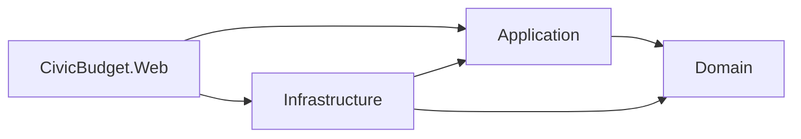
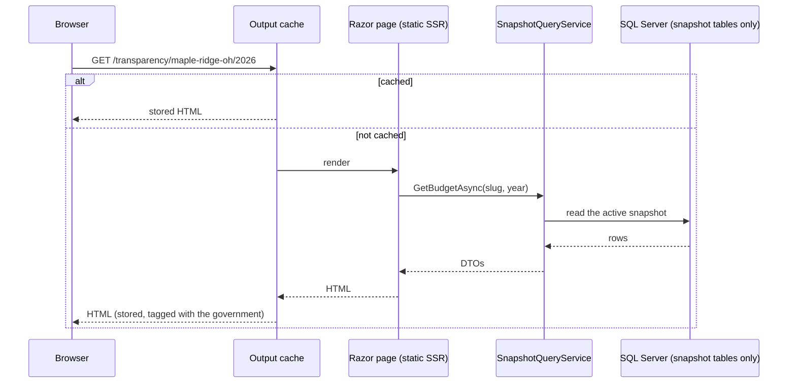
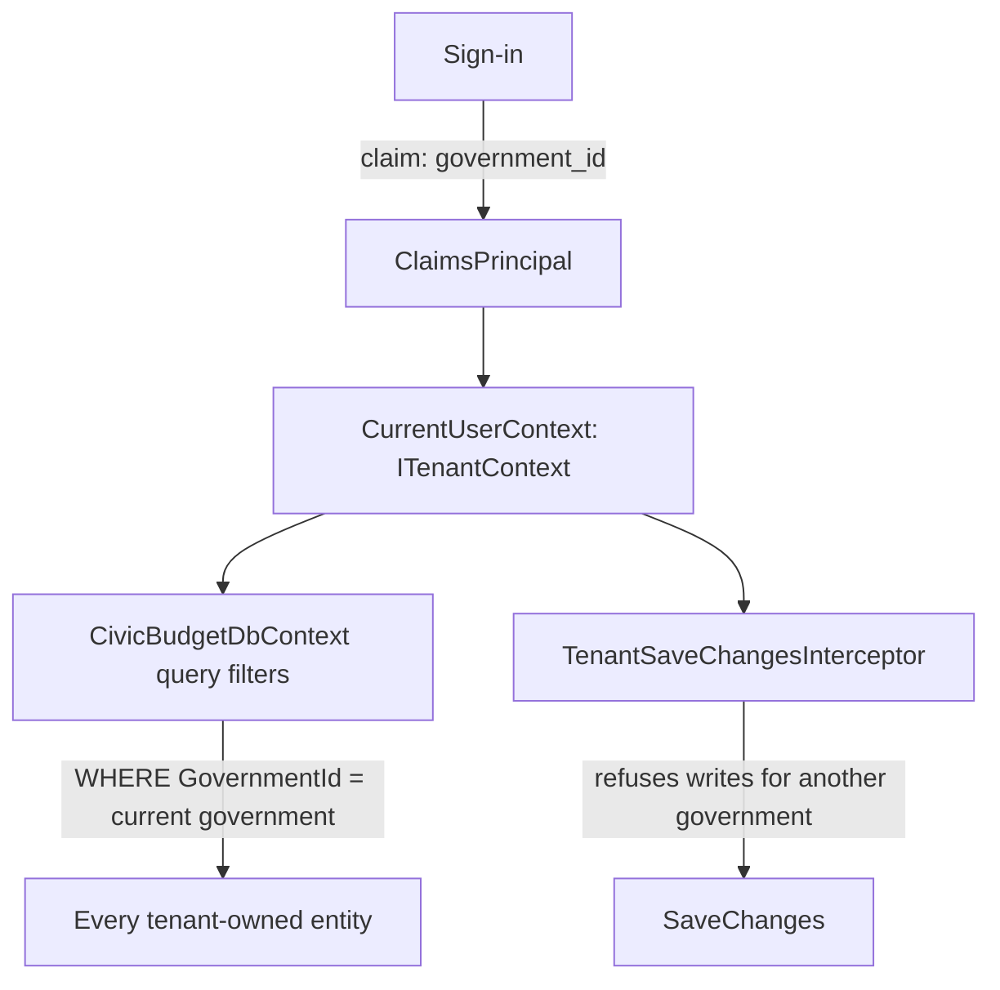
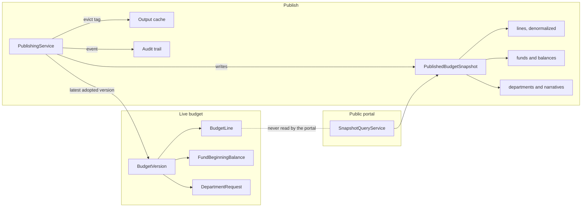

# CivicBudget: Architecture

This explains how the system is put together and why. Where a choice had real
alternatives, the reasoning is in [DECISIONS.md](DECISIONS.md) as an ADR
(architecture decision record), referenced here as ADR-nnnn. What the app does is
in [SPEC.md](SPEC.md).

---

## 1. Solution layout and the dependency rule

```
src/
  CivicBudget.Domain          entities, value objects, budget rules, domain exceptions
  CivicBudget.Application     use cases (services), DTOs, validators, and the interfaces they need
  CivicBudget.Infrastructure  EF Core contexts, configurations, migrations, interceptors,
                              Identity, Excel reading and writing, seed data
  CivicBudget.Web             Blazor Web App: admin (Interactive Server) and portal (static SSR),
                              account pages, file endpoints, startup, the composition root
tests/
  CivicBudget.Domain.Tests        the budget rules, no database
  CivicBudget.Application.Tests   pure rules (import, reports, permissions, chart diff), validators, architecture
  CivicBudget.Web.Tests           components (bUnit), authorization policies, middleware, caching
  CivicBudget.IntegrationTests    services against a real SQL Server (Testcontainers)
  CivicBudget.Infra.Tests         assertions on the synthesized AWS CloudFormation
infra/
  CivicBudget.Infra               AWS CDK app in C#
  azure/main.bicep                the live demo on Azure
```



**The dependency rule: arrows point inward.** `Domain` references nothing but .NET
itself. `Application` references `Domain`, EF Core's query abstractions, and
FluentValidation, and it declares the interfaces it needs (`ICivicBudgetDbContext`,
`ITenantContext`, `ICurrentUser`, `IUserAdminService`, `ISpreadsheetReader`, …),
which `Infrastructure` implements (ADR-0014). `Web` is the composition root, the one
project that knows about all of them. `ArchitectureTests` fails the build if a
reference points the wrong way or a Razor component takes a DbContext.

**Why four projects and not more.** Four is enough to keep EF Core out of the budget
rules and the budget rules out of Razor components, which are the two mistakes that
make Blazor apps hard to test. A mediator, CQRS, or a repository per entity would
add ceremony without making anything clearer at this size (ADR-0001).

**Where logic lives:**

| Kind of logic | Lives in | Example |
|---|---|---|
| A rule about one aggregate | A method on the entity | `BudgetVersion.Adopt(...)` refuses unless the version is Proposed |
| A calculation over many things | A static, pure domain class | `FundBalanceCalculator`, `AppropriationLimitCheck` |
| Orchestrating a use case | An application service | `BudgetEntryService.UpdateLineAmountAsync` |
| A rule shared by screens and services | A pure application class | `BudgetLinePermissions`, `ImportAnalyzer`, `ChartDiff` |
| The shape of a request | A FluentValidation validator | `AddBudgetLineRequestValidator` |
| Persistence, tenancy, audit | Infrastructure | `CivicBudgetDbContext`, `AuditInterceptor` |
| Rendering and interaction | Razor components | `AccountLineGrid.razor` |

---

## 2. Request flow

### 2.1 Admin app (Interactive Server)

```mermaid
sequenceDiagram
  participant B as Browser
  participant C as Blazor circuit (SignalR)
  participant R as Razor component
  participant S as Application service
  participant F as DbContext factory
  participant DB as SQL Server
  B->>C: user changes an amount
  C->>R: event handler
  R->>S: UpdateLineAmountAsync(version, line, amount)
  S->>F: CreateDbContextAsync()
  F-->>S: a short-lived DbContext for this unit of work
  S->>DB: load the budget version
  S->>S: permission rule, then BudgetVersion.UpdateLineAmount
  S->>DB: SaveChanges (audit and tenant interceptors run; revision checked)
  DB-->>S: saved, or refused because someone else saved first
  S-->>R: Result
  R->>S: reload the workspace
  R->>C: re-render
  C-->>B: DOM patch
```

The page reloads the workspace from the service after every change rather than
patching what is on screen, so fund balances and subtotals always come from saved data.

### 2.2 Public portal (static SSR)



No circuit, no WebSocket, no per-visitor state on the server. Publishing drops the
government's cached pages by tag.

---

## 3. Render modes (ADR-0002)

| Area | Mode | Why |
|---|---|---|
| Admin app, layout included | Interactive Server, set once on `Routes` in `App.razor` | Editing grids, live fund balances, dialogs, toasts, a collapsible menu. Server-side keeps the domain and EF Core off the client and keeps authorization simple. |
| Portal, account pages, error pages | Static SSR (`[ExcludeFromInteractiveRouting]`) | Each visit is a plain HTTP request: cacheable, crawlable, small, and no connection held open per visitor. The account pages need `HttpContext` to set cookies, which a circuit does not have. |
| Portal charts and search | Static SSR, no JavaScript at all | Bars are CSS with the value beside each one and a table twin; the `$ \| %` toggle is two links; search is a GET form; the spending and revenue panels switch with radio buttons and CSS. |

A SignalR circuit costs server memory for every connected user. That is fine for
twenty finance staff and wrong for twenty thousand citizens on budget-adoption night.
Static pages also carry no script tags at all: `App.razor` only includes Blazor's
script when the page is interactive.

Setting the render mode once, on `Routes`, rather than per page matters: with
per-page render modes the layout stays static, so the sidebar and the toast host
could never react to anything.

---

## 4. Data access

### 4.1 A DbContext per unit of work (ADR-0003)
In an ordinary ASP.NET Core request, a scoped `DbContext` lives for one request. In
Blazor Server the scope is the **circuit**, which lives as long as the browser tab. A
scoped context injected into a component would:
1. live for hours, tracking more and more entities and serving stale data, and
2. be shared by overlapping event handlers on the same circuit. `DbContext` is not
   thread-safe, so two awaits in flight throw "A second operation was started on
   this context".

So components never see a DbContext. They call application services, and each
service method opens its own:

```csharp
await using ICivicBudgetDbContext db = await dbFactory.CreateDbContextAsync(ct);
```

### 4.2 Two contexts, one database (ADR-0006)
- `CivicBudgetDbContext`: the whole admin model, Identity, the audit trail, the
  snapshots. It owns the migrations.
- `PublicPortalDbContext`: maps **only** the four snapshot tables and the government
  logo (a public image, ADR-0029). It filters to active snapshots, does not track,
  and throws on `SaveChanges`. It shares `PublishedSnapshotModel.Configure` with the
  admin context, so the two mappings cannot drift. The portal uses nothing else.

Both use one connection string today. A production deployment could give the portal
a SQL login with `SELECT` on the snapshot tables only; the code already cannot reach
anything else, so the login would be a second lock.

### 4.3 Money
`decimal` everywhere. A model convention maps every `decimal` property to
`decimal(18,2)`, so a new money field cannot be mapped wrongly by omission.
Rounding lives in `Money` with an explicit `MidpointRounding.AwayFromZero` and tests,
because .NET's default banker's rounding is not what finance staff see in Excel.

### 4.4 Concurrency (ADR-0033)
Each budget service loads a version, changes it, and saves. Without a check, two
people doing that at once both succeed and the second silently overwrites the first;
worse, an amount edit could land on a budget adopted a moment earlier. `BudgetVersion`
carries a `Revision` that every mutating method increments, and EF maps it as a
concurrency token, so the UPDATE says `WHERE Revision = <the value I loaded>`. Because
even a line edit bumps the version's revision, the version's row is always part of the
save and always checked. The services save through `TrySaveAsync`, which turns the
refusal into "someone else changed this budget; reload" and leaves the first change
standing. A SQL `rowversion` column would not work here: it only changes when the
version's own row changes, not when one of its lines does.

---

## 5. Tenancy (ADR-0004, ADR-0013, ADR-0015)



- Every tenant-owned entity implements `ITenantOwned { Guid GovernmentId }` and takes
  the id in its constructor.
- `OnModelCreating` finds every `ITenantOwned` type by reflection and adds a query
  filter that reads the current government **per query** (the filter captures the
  context, not a value, so one compiled model serves every government). With no
  government set, the filter matches nothing: no tenant means no data, never all data.
  An integration test proves no tenant-owned entity is left unfiltered.
- `TenantSaveChangesInterceptor` refuses any added, modified, or deleted row whose
  `GovernmentId` is not the current government, and any write when none is set.
- The government comes from the `government_id` claim issued at sign-in.
  `CurrentUserMiddleware` copies the signed-in user into the request's scope, and
  `CurrentUserCircuitHandler` does the same for an Interactive Server circuit, which
  has a scope of its own that the HTTP middleware never runs for.
- The portal never sets a government. It reads through `PublicPortalDbContext`, and
  every query takes the government's slug from the URL.
- Identity's tables are outside the filter, because sign-in has to find a user before
  anyone knows their government. `UserAdminService` scopes every query explicitly.
- Application code never calls `IgnoreQueryFilters()`; only tests do, to check what
  the filters hide.

---

## 6. Publishing and the snapshot boundary (ADR-0005, ADR-0019)



Why a snapshot rather than "show the adopted version":
1. **Security.** The portal has no code path to draft or proposed data; its context
   does not map those tables.
2. **History.** What citizens saw on a given day is preserved even if an account is
   renamed or a fund retired later, because the snapshot keeps its own copies of names
   and codes.
3. **Speed.** Denormalized rows aggregate without joining five tables per page view,
   and invalidation is one tag.
4. **Accountability.** Publishing and unpublishing are explicit, attributed events.

Only the latest adopted version of a year can be published, and the database allows
one active snapshot per year (a filtered unique index), so two publishes racing each
other cannot leave the portal choosing between two budgets.

---

## 7. Identity and authorization (ADR-0026)

- ASP.NET Core Identity (`AddIdentityCore`) with cookie sign-in and EF Core stores in
  `CivicBudgetDbContext`. `ApplicationUser` adds `GovernmentId`, `DisplayName`, and
  `MustChangePassword`; `UserDepartments` holds a department user's assignments. At
  sign-in the claims factory adds `government_id`, `display_name`, and one
  `department_id` per assignment, so later requests need no database call to know
  who and where the user is. There is no self-registration, external login, or 2FA:
  administrators create accounts.
- **Roles:** Administrator, Fiscal Officer, Department User, Viewer. (The stored
  names are the older `Admin`, `FinanceDirector`, `DepartmentHead`, `Viewer`; only the
  labels changed.) The Administrator can do everything the Fiscal Officer can.
- **Policies** name capabilities, not roles: `CanManageUsers`, `CanMaintainSetup`,
  `CanViewBudget`, `CanEditBeginningBalances`, `CanAdvanceWorkflow`, `CanPublish`,
  `CanImport`, `CanViewAudit`. `AuthorizationPolicies` is the one place that maps them
  to roles, and a test covers every cell of the matrix.
- **"May this user edit this line"** depends on the line's department, the version's
  status, and whether the department has submitted, so it is a resource-based rule:
  `BudgetLinePermissions.CanEdit`, a pure function that the authorization handler, the
  services, and the tests all call.
- **Two locks.** Pages carry `[Authorize(Policy = ...)]`, and every service that writes
  checks the caller's role itself. A page attribute is one typo away from letting a
  Viewer in; `AdminPagePolicyTests` pins the attribute on every admin page anyway.
- **Temporary passwords.** A password an administrator sets is temporary; a claim
  marks it and `MustChangePasswordMiddleware` keeps the user on the change-password page.
- **Open sessions.** A circuit can outlive a change to the user, so the authentication
  state is revalidated against the security stamp every 30 minutes, and role changes
  and lockouts update the stamp.

---

## 8. Audit trail (ADR-0017)

`AuditInterceptor` runs inside `SaveChanges`, walks the change tracker for added,
modified, and deleted entities marked `[Audited]`, and adds an `AuditEntry` per
created or deleted row and per changed property (entity, field, old value, new value,
user, time, government). The rows go into the same save, so an audited change cannot
commit without its history. Services add named events with `AuditEntry.Event(...)`
("Adopted by resolution 2027-14") because a field-level diff shows what changed but
not why. Properties whose change is already told by such an event (who submitted, and
when) are `[NotAudited]`, so the timeline is not cluttered with ids and timestamps.

---

## 9. Validation (ADR-0007)

FluentValidation, one validator per request, registered by assembly scan. Services
run the validator and return a `Result` with errors for expected failures (bad input,
a duplicate code, a rule that says no), which the page shows beside the field. Domain
invariants still throw `DomainException`: reaching one means a bug or a bypassed
screen, not a user's typo.

---

## 10. Startup and the waiting screen (ADR-0031)

The live demo's database pauses after an hour idle and takes up to a minute to
resume. The app therefore starts listening **before** the database is ready:

- `DatabaseStartupService` (a hosted service) migrates and seeds in the background and
  then marks `StartupState` ready.
- Until then, `WakingUpMiddleware` answers every page request with a small,
  self-contained waiting screen (503 with `Retry-After`) that polls `/health/startup`
  and reloads itself when the app is ready.
- After a long quiet spell the container may still be up while the database has
  paused, so the next page request checks the database first (`DatabaseWaker`) and only
  shows the screen if the check is slow.
- `/health` and `/health/startup` never touch the database: they are anonymous, and an
  endpoint that opened a connection per call would let anyone keep the free database
  awake until its monthly allowance ran out.
- ASP.NET Core Data Protection normally reads its key ring (stored in SQL Server here)
  during host startup, before Kestrel listens. `DeferKeyRingLoad` removes that step, so
  the keys load on first use instead. That single hidden database call was what made
  the first visitor stare at a blank browser for a minute.

---

## 11. Cross-cutting

| Concern | Approach |
|---|---|
| Logging | The built-in `ILogger`: single-line text in development, JSON lines elsewhere, which any log store can search by field |
| Errors | `UseExceptionHandler("/Error")` with a friendly page; an `ErrorBoundary` in the admin layout so one failing page does not take down the circuit; re-executed `/not-found` for 404s |
| Health | `/health` (the process is up) and `/health/startup` (migrations and seed are done), both answered from memory |
| Configuration and secrets | `appsettings.json` for everything that is not secret; user-secrets locally; Container Apps secrets on Azure; Secrets Manager on AWS |
| Output caching | `PortalOutputCachePolicy` as the base policy: `GET /transparency/**` only, varied by path and the three query keys the pages read, tagged `portal:{slug}`. `PortalResponseMiddleware` rewrites Blazor's `no-store` to a public max-age and drops the antiforgery cookie on portal pages (ADR-0021) |
| Time | `TimeProvider` everywhere, so tests control "now"; screens show Eastern time, the zone every Ohio government is in |
| Excel | ClosedXML on the server; no Office, no COM |
| Uploads | Profile pictures and logos are resized by the browser, then checked on the server for a PNG, JPEG, or WebP signature and a size cap, and served with `nosniff` and a locked-down CSP |
| Downloads | CSV cells that a spreadsheet would read as a formula get a leading apostrophe |

---

## 12. Testing strategy

| Level | Project | Tool | Covers |
|---|---|---|---|
| Domain | Domain.Tests | xUnit | Every budget rule, rounding, workflow transitions, amendments, starting a year |
| Application | Application.Tests | xUnit | Import analysis, report building, chart diff, permissions, validators, the dependency rule |
| Components | Web.Tests | bUnit | Pages and components against fake services; policies; middleware; cache policy |
| Integration | IntegrationTests | Testcontainers, SQL Server 2022 | Services end to end, migrations, tenant isolation, audit, publishing, concurrency, seed and reset |
| Infrastructure | Infra.Tests | CDK assertions | Security and cost properties of the AWS templates |

Integration tests share one SQL Server container. The fixture migrates and seeds one
template database per run, backs it up inside the container, and restores a fresh
copy under a unique name for each test that needs seeded data, which keeps tests
independent of each other and of the order xUnit runs them in, without paying for a
migration and seed every time.

---

## 13. Deployment

### 13.1 Azure: the live demo (ADR-0030)
The same Docker image, on the free tiers: a serverless Azure SQL database on the free
offer (it pauses rather than bills when the monthly allowance runs out) and a
Container App on the consumption plan (zero to one replica, WebSockets for the
circuit, TLS at the ingress). A scheduled Container Apps job runs the image with
`--reseed` every night, so the published demo logins can be shared freely.
`infra/azure/main.bicep` declares it, `scripts/azure-setup.sh` creates it once, and
`deploy-azure.yml` deploys every commit on `main` after CI passes, signing in with OIDC.

### 13.2 AWS: deploy-ready (ADR-0008, ADR-0023)
Built and tested, never deployed: there is no AWS account behind this repository.
Everything up to `cdk deploy` runs in CI (`cdk synth`, 18 assertion tests, a Docker
build).

```mermaid
graph TB
  Dev[git tag v1.2.3] --> GH[GitHub Actions deploy.yml]
  GH -->|OIDC: assume role, no stored keys| IAM[IAM deploy role]
  GH -->|docker push :sha| ECR[ECR repository]
  GH -->|cdk deploy -c imageTag=sha| CFN[CloudFormation from the C# CDK app]
  subgraph VPC: 2 AZs, 1 NAT
    subgraph Public subnets
      ALB[Application Load Balancer, sticky sessions, /health]
    end
    subgraph Private subnets
      ECS[Fargate task, 0.5 vCPU / 1 GB]
      RDS[(RDS SQL Server Express, encrypted)]
    end
  end
  Internet((Citizens and staff)) --> ALB --> ECS -->|1433, from the app only| RDS
  ECS -->|at task start| SM[Secrets Manager]
  ECS -->|JSON logs| CW[CloudWatch Logs, 30 days]
  BUD[AWS Budgets alarm] -.-> Dev
```

- **Stacks:** `CivicBudget-GitHubOidc`, deployed once by hand (the OIDC provider, the
  deploy role, and the ECR repository, which must exist before the first push), and
  `CivicBudget-App` (everything else).
- **Secrets:** ECS injects the database password (from the RDS-managed secret) and
  the demo password as environment variables at start. The app builds its connection
  string from plain settings plus the password (`DatabaseOptions`), so there is no
  derived connection-string secret to keep in sync when RDS rotates the password. A
  test proves no password appears in the template.
- **State that must survive a restart:** Data Protection keys are in SQL Server, so
  sign-in cookies outlive the container.
- **Scaling:** one task by design. Sticky sessions and shared keys are ready; the
  portal's output cache would need a shared store (Redis) before a second task, or an
  eviction on one task would not reach the other.
- **Cost:** about $90 a month at list price, a third of it the NAT gateway;
  `cdk destroy CivicBudget-App` leaves nothing billing.

---

## 14. Local development

```bash
./scripts/dev-setup.sh                     # once: .env and the connection string in user-secrets
docker compose up -d                       # SQL Server 2022 (amd64, under Rosetta on Apple Silicon)
dotnet run --project src/CivicBudget.Web   # migrates and seeds in Development
```

The demo logins are seeded for every role; their password comes from user-secrets
(`Seed:DemoPassword`), so nothing is committed.
