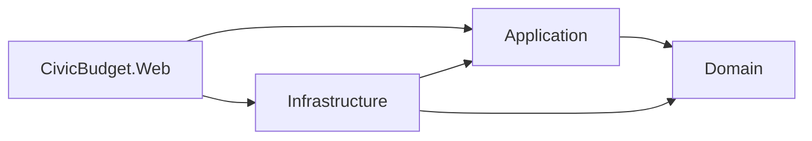
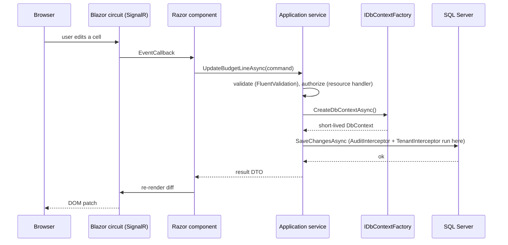
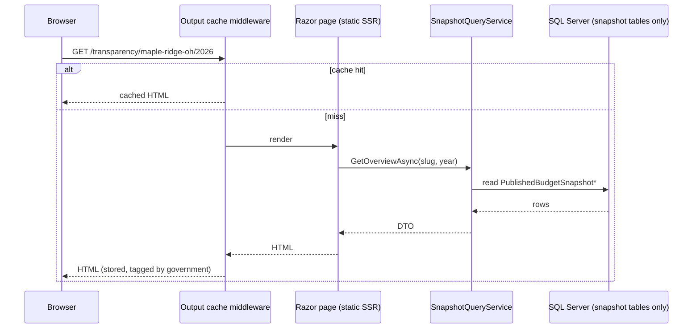
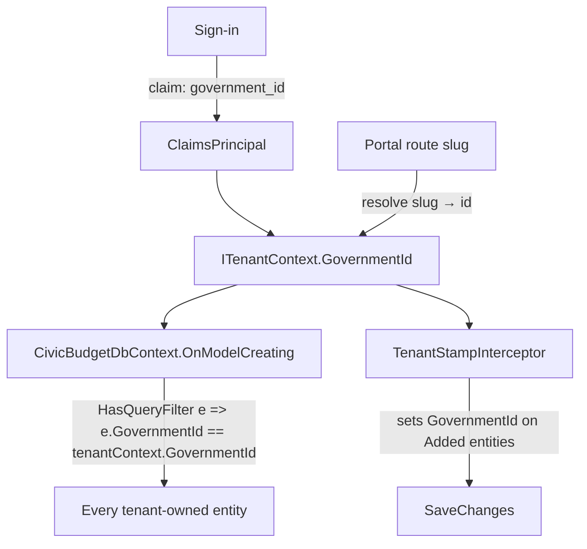
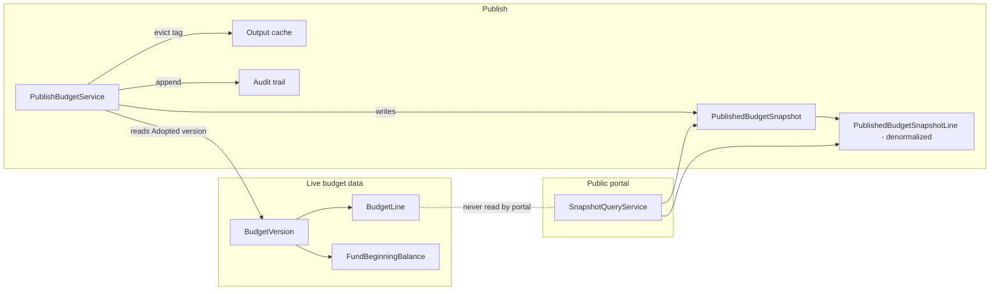
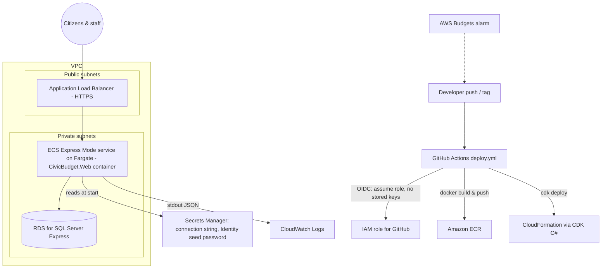

# CivicBudget — Architecture

This document explains *how* the system is put together and *why*. Each
section is written so it can be explained in an interview. Decisions with real
alternatives are cross-referenced to `DECISIONS.md` (ADR-nnnn).

---

## 1. Solution layout and the dependency rule

```
/src
  CivicBudget.Domain          entities, enums, value objects, domain rules, domain exceptions
  CivicBudget.Application     use cases (services), DTOs, validators, interfaces (ports)
  CivicBudget.Infrastructure  EF Core DbContexts, configurations, migrations, interceptors,
                              Identity stores, Excel/CSV I/O, tenant context implementation
  CivicBudget.Web             Blazor Web App: admin (Interactive Server) + portal (static SSR),
                              Identity UI, DI composition root, health check, error pages
/tests
  CivicBudget.Domain.Tests        xUnit — pure domain rules, rounding
  CivicBudget.Application.Tests   xUnit — services with an in-memory/SQLite-free approach
                                  (Testcontainers where SQL semantics matter)
  CivicBudget.Web.Tests           bUnit — components; authorization policy tests
  CivicBudget.IntegrationTests    Testcontainers (SQL Server) — migrations, query filters,
                                  audit interceptor, publishing
/infra
  CivicBudget.Infra               AWS CDK (C#) + CDK assertion tests
/docs
```



**Dependency rule:** arrows point inward. `Domain` references nothing but the
BCL. `Application` references `Domain` and defines interfaces
(`IBudgetRepository`, `ITenantContext`, `IClock`, `IExcelExporter`, …) that
`Infrastructure` implements. `Web` is the composition root and the only
project that knows about all of them.

**Why this shape (and not more layers):** four projects is enough to keep EF
Core out of the domain and business rules out of Razor components, which are
the two mistakes that make Blazor apps hard to test. More layers (CQRS
buses, mediator, repositories-per-aggregate) would add ceremony without
adding clarity for a project this size. See ADR-0001.

**Where logic lives:**
| Kind of logic | Lives in | Example |
|---|---|---|
| Invariants on an entity | Domain entity method | `BudgetVersion.Adopt(resolutionNumber)` throws if not Proposed |
| Calculations over many entities | Domain service (static, pure) | `FundBalanceCalculator` |
| Use case orchestration, transactions | Application service | `BudgetLineService.UpdateAmountAsync` |
| Input shape validation | Application validator (FluentValidation) | `UpdateBudgetLineValidator` |
| Persistence, tenancy filter, audit | Infrastructure | `CivicBudgetDbContext`, `AuditInterceptor` |
| Rendering, user interaction | Web (Razor components) | `BudgetGrid.razor` |

---

## 2. Request flow

### 2.1 Admin (Interactive Server)


### 2.2 Public portal (static SSR)


No circuit, no WebSocket, no per-visitor server state. Publishing evicts the
cache by tag.

---

## 3. Render modes (ADR-0002)

| Area | Mode | Why |
|---|---|---|
| Admin app | `InteractiveServer` | Stateful grids with inline editing, live fund-balance panel, confirmation dialogs. Server-side keeps the domain and EF Core off the client and makes authorization simple. |
| Public portal | Static SSR (no interactivity) | Each citizen visit is a plain HTTP request: cacheable, crawlable, tiny payload, no SignalR connection to hold open per visitor. Core tables work with JavaScript disabled. |
| Portal enhancements (charts, search box) | Static SSR + minimal progressive enhancement | Charts render from a data table that is always present; JavaScript enhances, never replaces. |

Interview talking point: a SignalR circuit costs server memory per connected
user. That is fine for 20 finance staff and wrong for 20,000 citizens on
budget-adoption night.

---

## 4. Data access

### 4.1 `IDbContextFactory<T>` in Blazor Server (ADR-0003)
In a normal ASP.NET Core request, a scoped `DbContext` lives for one HTTP
request and is disposed. In Blazor Server, the "scope" is the **circuit**,
which lives as long as the browser tab. A scoped `DbContext` injected into a
component would:
1. live for minutes or hours, accumulating tracked entities (memory growth,
   stale data), and
2. be shared by concurrent event handlers on the same circuit — `DbContext`
   is not thread-safe, so two overlapping awaits cause
   `InvalidOperationException: A second operation was started…`.

Therefore components and application services never inject `DbContext`
directly. They take `IDbContextFactory<CivicBudgetDbContext>` and create a
context per unit of work:

```csharp
await using var db = await _dbFactory.CreateDbContextAsync(ct);
```

### 4.2 Two DbContexts, one database (ADR-0006)
- `CivicBudgetDbContext` — the full admin model, Identity tables, audit,
  snapshots. Owns the migrations.
- `PublicPortalDbContext` — maps **only** the snapshot tables, `NoTracking`
  by default, no `SaveChanges` exposed. Used exclusively by the portal.

Same connection string in development; in AWS the portal can use a SQL login
with `SELECT` on snapshot tables only — the code already can't reach anything
else, and the database login makes it defense-in-depth.

### 4.3 Money
`decimal` everywhere. A model-building convention sets `decimal(18,2)` for
every `decimal` property so no configuration can be forgotten. Percent
calculations are domain functions with explicit `MidpointRounding` and tests.

---

## 5. Tenancy (ADR-0004)



- Every tenant-owned entity implements `ITenantOwned { Guid GovernmentId }`.
- `OnModelCreating` loops over entity types implementing `ITenantOwned` and
  adds a global query filter that reads `ITenantContext.GovernmentId` at
  query time (the filter captures the context instance, not a value, so one
  model serves all tenants).
- A `SaveChanges` interceptor stamps `GovernmentId` on new entities and
  rejects entities whose `GovernmentId` doesn't match the current tenant.
- `IgnoreQueryFilters()` is banned in application code (an analyzer-style
  test greps for it) except inside the seed/migration tooling.
- The admin tenant comes from a claim issued at sign-in; the portal tenant
  comes from the URL slug via a route-value-based `ITenantContext`.
- Integration tests prove isolation: seed two tenants, query as one, assert
  the other's rows are invisible and cannot be written to.

---

## 6. Publishing and the snapshot boundary (ADR-0005)



Why a snapshot rather than "show the adopted version":
1. **Security:** the portal has no code path to draft or proposed data. The
   `PublicPortalDbContext` doesn't map those tables.
2. **Immutability:** what citizens saw on a given date is preserved even if
   the chart of accounts is later renamed or a fund retired — the snapshot
   carries its own copies of names and codes.
3. **Performance:** denormalized rows aggregate with simple `GROUP BY`, no
   joins across five tables per page view, and cache invalidation is a single
   tag eviction.
4. **Auditability:** publish and unpublish are explicit, attributed events.

---

## 7. Identity and authorization

- ASP.NET Core Identity with cookie authentication, EF Core stores in
  `CivicBudgetDbContext`. Users carry `GovernmentId`; the claims factory adds
  `government_id`, role, and `department_id` claims at sign-in.
- **Roles:** `Admin`, `FinanceDirector`, `DepartmentHead`, `Viewer`.
- **Policies** (named constants in `Application`): `CanManageUsers`,
  `CanMaintainSetup`, `CanViewBudget`, `CanEditBeginningBalances`,
  `CanAdvanceWorkflow`, `CanPublish`, `CanImport`, `CanViewAudit`.
- **Resource-based handler:** `BudgetLineEditRequirement` — the handler
  receives the line and version, and succeeds if (FD and version not Adopted)
  or (DH and line.DepartmentId ∈ user's departments and version is Draft).
  Called from the application service, not only from the UI, so the rule holds
  for imports too.
- Tests build `ClaimsPrincipal`s directly and evaluate policies through
  `IAuthorizationService` — no browser needed.

---

## 8. Audit trail

`AuditInterceptor : SaveChangesInterceptor` runs in `SavingChangesAsync`,
walks `ChangeTracker.Entries()` for Added/Modified/Deleted entities that are
marked `[Auditable]`, and appends `AuditEntry` rows (entity name, key,
property, old value, new value, user id, UTC timestamp, tenant) in the same
transaction. Workflow and publish actions additionally write an explicit
`AuditEvent` ("Adopted version 2 with resolution 2026-14") because a
field-level diff alone doesn't explain *why*.

---

## 9. Validation (ADR-0007)

FluentValidation, one validator per command DTO, registered by assembly scan.
Application services run the validator and return a result type
(`Result<T>` with a list of errors) rather than throwing for expected
failures. Domain invariants still throw `DomainException` — those are bugs
or bypass attempts, not user input errors.

---

## 10. Cross-cutting

| Concern | Approach |
|---|---|
| Logging | Built-in `ILogger` with the JSON console formatter; scopes carry `GovernmentId`, `UserId`, `TraceId`. |
| Errors | `UseExceptionHandler("/error")` with a friendly page; `ProblemDetails` for API-style endpoints (downloads). |
| Health | `/health` (liveness) and `/health/ready` (checks SQL connectivity). |
| Config & secrets | `appsettings.json` for non-secrets; `dotnet user-secrets` locally; AWS Secrets Manager → environment at container start. |
| Output caching | `AddOutputCache` with a portal policy: vary by route, tag `gov:{slug}`; evicted on publish/unpublish. |
| Time | `IClock` abstraction (`TimeProvider`) so tests control "now". |
| Excel | ClosedXML server-side; no COM/Office dependency. |

---

## 11. Testing strategy

| Level | Project | Tool | Covers |
|---|---|---|---|
| Domain | Domain.Tests | xUnit | Every rule in SPEC §5, rounding, workflow transitions, amendment copy |
| Application | Application.Tests | xUnit (+ Testcontainers where SQL semantics matter) | Services, validators, authorization handlers |
| Components | Web.Tests | bUnit | Grid rendering, fund balance panel states, confirmation dialogs |
| Integration | IntegrationTests | Testcontainers SQL Server 2022 | Migrations apply, tenancy filter, audit interceptor, publish → snapshot, portal queries |
| Infra | Infra tests | `Amazon.CDK.Assertions` | Synthesized template invariants |

Testcontainers uses the same `mcr.microsoft.com/mssql/server:2022-latest`
image as `docker-compose`; on Apple Silicon it runs under Rosetta, on GitHub's
Ubuntu runners natively.

---

## 12. AWS deployment (Phase 7, deploy-ready — ADR-0008)

Target shape (to be confirmed against current AWS docs in Phase 7; the
tentative choice is **ECS Express Mode on Fargate** over Elastic Beanstalk):



- **OIDC:** GitHub presents a short-lived token; AWS IAM trusts the GitHub
  OIDC provider for `repo:SpencerSmithSite/civic-budget:ref:refs/tags/*`.
  No `AWS_ACCESS_KEY_ID` secret ever exists in GitHub.
- **Secrets:** the container's task definition references Secrets Manager
  ARNs; ECS injects them as environment variables at start.
- **Cost (estimate, to be refreshed in Phase 7):** RDS SQL Server Express
  `db.t3.micro` ≈ $15–20/mo dominates; Fargate 0.25 vCPU/0.5 GB ≈ $9/mo;
  ALB ≈ $16/mo. Teardown: `cdk destroy --all`.
- **Without an AWS account:** `cdk synth` and the assertion tests run in CI
  with no credentials; `deploy.yml` is `workflow_dispatch`-gated and fully
  written. See ADR-0008.

---

## 13. Local development

```
docker compose up -d          # SQL Server 2022 (amd64 under Rosetta on Apple Silicon)
dotnet run --project src/CivicBudget.Web   # applies migrations + seeds on first run in Development
```

Demo logins are seeded for each role; passwords come from user-secrets
(`Seed:DemoPassword`) so nothing is committed.
