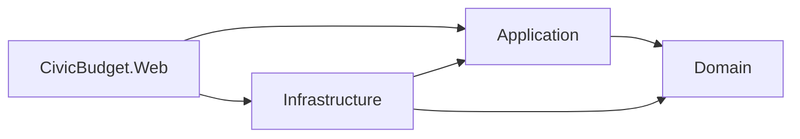
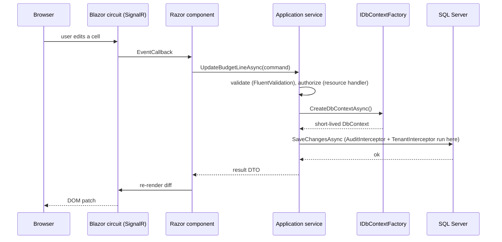
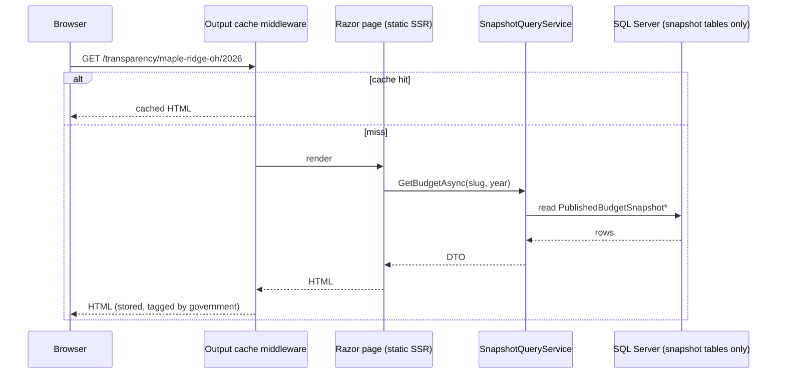
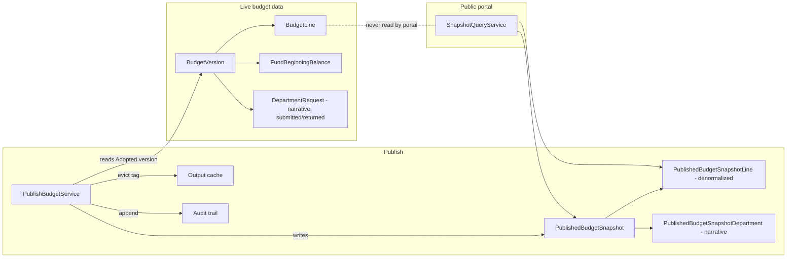

# CivicBudget — Architecture

This document explains *how* the system is put together and *why*. Each
section is written so it can be explained in an interview. Decisions with real
alternatives are cross-referenced to `DECISIONS.md` (ADR-nnnn).

---

## 1. Solution layout and the dependency rule

```
/src
  CivicBudget.Domain          entities, enums, value objects, domain rules, domain exceptions
  CivicBudget.Application     use cases (services), DTOs, validators, interfaces (ports)
  CivicBudget.Infrastructure  EF Core DbContexts, configurations, migrations, interceptors,
                              Identity stores, Excel/CSV I/O, tenant context implementation
  CivicBudget.Web             Blazor Web App: admin (Interactive Server) + portal (static SSR),
                              Identity UI, DI composition root, health check, error pages
/tests
  CivicBudget.Domain.Tests        xUnit — pure domain rules, rounding
  CivicBudget.Application.Tests   xUnit — services with an in-memory/SQLite-free approach
                                  (Testcontainers where SQL semantics matter)
  CivicBudget.Web.Tests           bUnit — components; authorization policy tests
  CivicBudget.IntegrationTests    Testcontainers (SQL Server) — migrations, query filters,
                                  audit interceptor, publishing
/infra
  CivicBudget.Infra               AWS CDK (C#) + CDK assertion tests
/docs
```



**Dependency rule:** arrows point inward. `Domain` references nothing but the
BCL. `Application` references `Domain` plus the EF Core abstractions and
FluentValidation packages, and defines the interfaces (`ICivicBudgetDbContext`,
`ITenantContext`, `ICurrentUser`, `IUserAdminService`, …) that `Infrastructure`
implements (ADR-0014). `Web` is the composition root and the only project that
knows about all of them. `ArchitectureTests` enforces the rule.

**Why this shape (and not more layers):** four projects is enough to keep EF
Core out of the domain and business rules out of Razor components, which are
the two mistakes that make Blazor apps hard to test. More layers (CQRS
buses, mediator, repositories-per-aggregate) would add ceremony without
adding clarity for a project this size. See ADR-0001.

**Where logic lives:**
| Kind of logic | Lives in | Example |
|---|---|---|
| Invariants on an entity | Domain entity method | `BudgetVersion.Adopt(resolutionNumber)` throws if not Proposed |
| Calculations over many entities | Domain service (static, pure) | `FundBalanceCalculator` |
| Use case orchestration, transactions | Application service | `BudgetLineService.UpdateAmountAsync` |
| Input shape validation | Application validator (FluentValidation) | `UpdateBudgetLineValidator` |
| Persistence, tenancy filter, audit | Infrastructure | `CivicBudgetDbContext`, `AuditInterceptor` |
| Rendering, user interaction | Web (Razor components) | `BudgetGrid.razor` |

---

## 2. Request flow

### 2.1 Admin (Interactive Server)


### 2.2 Public portal (static SSR)


No circuit, no WebSocket, no per-visitor server state. Publishing evicts the
cache by tag.

---

## 3. Render modes (ADR-0002)

| Area | Mode | Why |
|---|---|---|
| Admin app (layout included) | `InteractiveServer`, applied to `Routes` in `App.razor` | Stateful grids with inline editing, live fund-balance panel, confirmation dialogs, toasts, a collapsible menu. Server-side keeps the domain and EF Core off the client and makes authorization simple. |
| Public portal | Static SSR (no interactivity) | Each citizen visit is a plain HTTP request: cacheable, crawlable, tiny payload, no SignalR connection to hold open per visitor. Core tables work with JavaScript disabled. |
| Portal charts and search | Static SSR, no JavaScript at all | Bars are CSS with the value beside each one and a `<details>` table twin; the `$ \| %` toggle is two links; search is a GET form. Nothing to enhance, nothing to break. |

Interview talking point: a SignalR circuit costs server memory per connected
user. That is fine for 20 finance staff and wrong for 20,000 citizens on
budget-adoption night.

---

## 4. Data access

### 4.1 `IDbContextFactory<T>` in Blazor Server (ADR-0003)
In a normal ASP.NET Core request, a scoped `DbContext` lives for one HTTP
request and is disposed. In Blazor Server, the "scope" is the **circuit**,
which lives as long as the browser tab. A scoped `DbContext` injected into a
component would:
1. live for minutes or hours, accumulating tracked entities (memory growth,
   stale data), and
2. be shared by concurrent event handlers on the same circuit — `DbContext`
   is not thread-safe, so two overlapping awaits cause
   `InvalidOperationException: A second operation was started…`.

Therefore components and application services never inject `DbContext`
directly. They take `IDbContextFactory<CivicBudgetDbContext>` and create a
context per unit of work:

```csharp
await using var db = await _dbFactory.CreateDbContextAsync(ct);
```

### 4.2 Two DbContexts, one database (ADR-0006)
- `CivicBudgetDbContext` — the full admin model, Identity tables, audit,
  snapshots. Owns the migrations.
- `PublicPortalDbContext` — maps **only** the four snapshot tables (plus `GovernmentLogos`, a public image, ADR-0029), filters to
  Active snapshots globally, `NoTracking` by default, and `SaveChanges` throws.
  Shares `PublishedSnapshotModel.Configure` with the admin context so the two
  mappings cannot drift; owns no migrations. Used exclusively by the portal.

Same connection string in development; in AWS the portal can use a SQL login
with `SELECT` on snapshot tables only — the code already can't reach anything
else, and the database login makes it defense-in-depth.

### 4.3 Money
`decimal` everywhere. A model-building convention sets `decimal(18,2)` for
every `decimal` property so no configuration can be forgotten. Percent
calculations are domain functions with explicit `MidpointRounding` and tests.

---

## 5. Tenancy (ADR-0004)


- Every tenant-owned entity implements `ITenantOwned { Guid GovernmentId }`.
- `OnModelCreating` loops over entity types implementing `ITenantOwned` and
  adds a global query filter that reads `ITenantContext.GovernmentId` at
  query time (the filter captures the context instance, not a value, so one
  model serves all tenants).
- A `SaveChanges` interceptor rejects any added/modified/deleted entity whose
  `GovernmentId` doesn't match the current tenant, or any write when no tenant
  is set (ADR-0013). Entities carry `GovernmentId` from their constructors.
- `IgnoreQueryFilters()` is banned in application code (an analyzer-style
  test greps for it) except inside the seed/migration tooling.
- The admin tenant comes from the `government_id` claim issued at sign-in.
  `CurrentUserContext` (scoped) is filled by `CurrentUserMiddleware` for HTTP
  requests and by `CurrentUserCircuitHandler` for Interactive Server circuits,
  which have their own DI scope. The portal never sets a tenant: it reads
  through `PublicPortalDbContext`, which has no tenant filter, and every
  query takes the government slug from the URL as a plain predicate.
- Identity tables are outside the filter (login must find a user before a
  tenant is known); `UserAdminService` scopes by government explicitly (ADR-0015).
- Integration tests prove isolation: seed two tenants, query as one, assert
  the other's rows are invisible and cannot be written to.

---

## 6. Publishing and the snapshot boundary (ADR-0005)



Why a snapshot rather than "show the adopted version":
1. **Security:** the portal has no code path to draft or proposed data. The
   `PublicPortalDbContext` doesn't map those tables.
2. **Immutability:** what citizens saw on a given date is preserved even if
   the chart of accounts is later renamed or a fund retired — the snapshot
   carries its own copies of names and codes.
3. **Performance:** denormalized rows aggregate with simple `GROUP BY`, no
   joins across five tables per page view, and cache invalidation is a single
   tag eviction.
4. **Auditability:** publish and unpublish are explicit, attributed events.

---

## 7. Identity and authorization

- ASP.NET Core Identity (`AddIdentityCore`) with cookie authentication, EF
  Core stores in `CivicBudgetDbContext`. `ApplicationUser` carries
  `GovernmentId` and `DisplayName`; `UserDepartments` holds Department Head
  assignments. `ApplicationUserClaimsPrincipalFactory` adds `government_id`,
  `display_name`, and one `department_id` claim per assignment at sign-in.
  No self-registration, external logins, passkeys, or 2FA.
- **Roles:** `Admin`, `FinanceDirector`, `DepartmentHead`, `Viewer`.
- **Policies** (named constants in `Application`): `CanManageUsers`,
  `CanMaintainSetup`, `CanViewBudget`, `CanEditBeginningBalances`,
  `CanAdvanceWorkflow`, `CanPublish`, `CanImport`, `CanViewAudit`.
- **Resource-based handler:** `BudgetLineEditHandler` receives a
  `BudgetLineResource(versionStatus, departmentId)` and delegates to the pure
  rule `BudgetLinePermissions.CanEdit`: FD while not Adopted; DH only in
  their departments and only while Draft. Services call the same rule, so it
  holds for imports too.
- Tests build `ClaimsPrincipal`s directly and evaluate policies through
  `IAuthorizationService` — no browser needed.

---

## 8. Audit trail

`AuditInterceptor : SaveChangesInterceptor` runs in `SavingChangesAsync`,
walks `ChangeTracker.Entries()` for Added/Modified/Deleted entities that are
marked `[Auditable]`, and appends `AuditEntry` rows (entity name, key,
property, old value, new value, user id, UTC timestamp, tenant) in the same
transaction. Workflow and publish actions additionally write an explicit
`AuditEvent` ("Adopted version 2 with resolution 2026-14") because a
field-level diff alone doesn't explain *why*.

---

## 9. Validation (ADR-0007)

FluentValidation, one validator per command DTO, registered by assembly scan.
Application services run the validator and return a result type
(`Result<T>` with a list of errors) rather than throwing for expected
failures. Domain invariants still throw `DomainException` — those are bugs
or bypass attempts, not user input errors.

---

## 10. Cross-cutting

| Concern | Approach |
|---|---|
| Logging | Built-in `ILogger` with the JSON console formatter; scopes carry `GovernmentId`, `UserId`, `TraceId`. |
| Errors | `UseExceptionHandler("/error")` with a friendly page; `ProblemDetails` for API-style endpoints (downloads). |
| Health | `/health` (liveness) and `/health/startup` (migrations and seed done). Neither queries the database; see ADR-0031. |
| Config & secrets | `appsettings.json` for non-secrets; `dotnet user-secrets` locally; AWS Secrets Manager → environment at container start. |
| Output caching | `AddOutputCache` with `PortalOutputCachePolicy` as the base policy: `GET /transparency/**` only, keyed by path + query, tagged `portal:{slug}`, evicted on publish/unpublish. `PortalResponseMiddleware` rewrites Blazor's `no-store` to `public, max-age=600` and drops the antiforgery cookie (ADR-0021). |
| Time | `IClock` abstraction (`TimeProvider`) so tests control "now". |
| Excel | ClosedXML server-side; no COM/Office dependency. |

---

## 11. Testing strategy

| Level | Project | Tool | Covers |
|---|---|---|---|
| Domain | Domain.Tests | xUnit | Every rule in SPEC §5, rounding, workflow transitions, amendment copy |
| Application | Application.Tests | xUnit (+ Testcontainers where SQL semantics matter) | Services, validators, authorization handlers |
| Components | Web.Tests | bUnit | Grid rendering, fund balance panel states, confirmation dialogs |
| Integration | IntegrationTests | Testcontainers SQL Server 2022 | Migrations apply, tenancy filter, audit interceptor, publish → snapshot, portal queries |
| Infra | Infra tests | `Amazon.CDK.Assertions` | Synthesized template invariants |

Testcontainers uses the same `mcr.microsoft.com/mssql/server:2022-latest`
image as `docker-compose`; on Apple Silicon it runs under Rosetta, on GitHub's
Ubuntu runners natively.

---

## 12. AWS deployment (deploy-ready — ADR-0008, ADR-0023)

Built and asserted, never deployed: there is no AWS account behind the repository. Everything up
to `cdk deploy` exists and runs in CI (`cdk synth`, 17 assertion tests, a Docker build).

```mermaid
graph TB
  Dev[git tag v1.2.3] --> GH[GitHub Actions deploy.yml]
  GH -->|OIDC: assume role, no stored keys| IAM[IAM role CivicBudget-GitHubDeploy]
  GH -->|docker build & push :sha| ECR[Amazon ECR civicbudget]
  GH -->|cdk deploy -c imageTag=sha| CFN[CloudFormation via CDK C#]
  subgraph VPC 2 AZs, 1 NAT
    subgraph Public subnets
      ALB[Application Load Balancer, sticky sessions, /health]
    end
    subgraph Private subnets
      ECS[Fargate task 0.5 vCPU / 1 GB: CivicBudget.Web]
      RDS[(RDS SQL Server Express db.t3.micro, encrypted)]
    end
  end
  Internet((Citizens & staff)) --> ALB --> ECS -->|1433, service SG only| RDS
  ECS -->|at task start| SM[Secrets Manager: RDS password, demo password]
  ECS -->|JSON stdout| CW[CloudWatch Logs, 30 days]
  BUD[AWS Budgets alarm 80% of $60] -.-> Dev
```

- **Stacks:** `CivicBudget-GitHubOidc` (once, by hand: OIDC provider + deploy role) and
  `CivicBudget-App` (everything else). `infra/CivicBudget.Infra`, tests in `tests/CivicBudget.Infra.Tests`.
- **Secrets:** the task definition references Secrets Manager entries; ECS injects
  `Database__Password` (from the RDS-managed secret) and `Seed__DemoPassword` as environment
  variables at start. The app builds its connection string from `Database:*` settings plus the
  password (`DatabaseOptions`). A test proves no password is in the template.
- **State that must survive a restart:** Data Protection keys live in SQL Server
  (`DataProtectionKeys`), so cookies and antiforgery tokens outlive the container.
- **Scaling:** one task by design; sticky sessions and shared keys are ready, the portal's output
  cache would need a Redis store before a second task (ADR-0023).
- **Cost:** about $90/mo at list price, a third of it the NAT gateway; `cdk destroy CivicBudget-App`
  leaves nothing billing (every resource is `RemovalPolicy.DESTROY` for the demo).
- **Local stand-in:** `docker compose -f docker-compose.full.yml up --build` runs the same image
  against SQL Server with the same environment variables ECS would inject.

### 12a. Azure: where the live demo actually runs (ADR-0030)

The same image, deployed where SQL Server is free: a serverless Azure SQL database under the
free offer (auto-pauses when idle, pauses rather than bills when the monthly limit is hit) and a
Container App on the consumption plan (0 to 1 replica, WebSockets, TLS at the ingress). A
scheduled Container Apps job runs the image with `--reseed` each night so the published demo
logins can be shared freely. `infra/azure/main.bicep` declares it, `scripts/azure-setup.sh`
creates it once, and `deploy-azure.yml` rolls every push to `main` over OIDC. The AWS stack
above stays as the production-shaped design; this is the showcase.

---

## 13. Local development

```
./scripts/dev-setup.sh        # once: generates .env + stores the connection string in user-secrets
docker compose up -d          # SQL Server 2022 (amd64 under Rosetta on Apple Silicon)
dotnet run --project src/CivicBudget.Web   # applies migrations + seeds on first run in Development
```

Demo logins are seeded for each role; passwords come from user-secrets
(`Seed:DemoPassword`) so nothing is committed.
